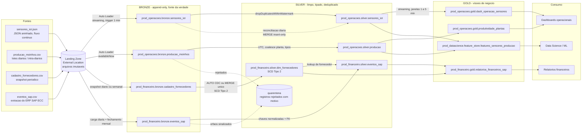
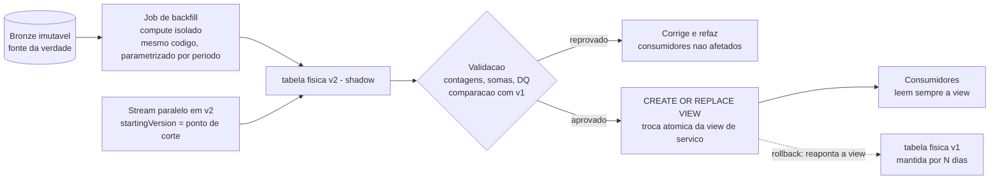
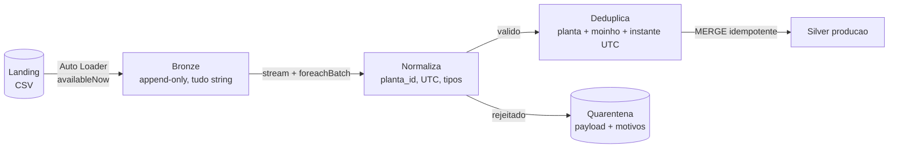
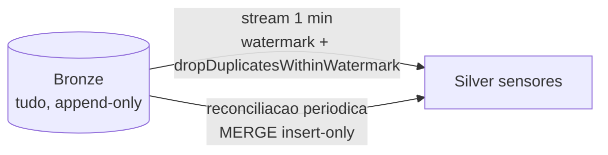
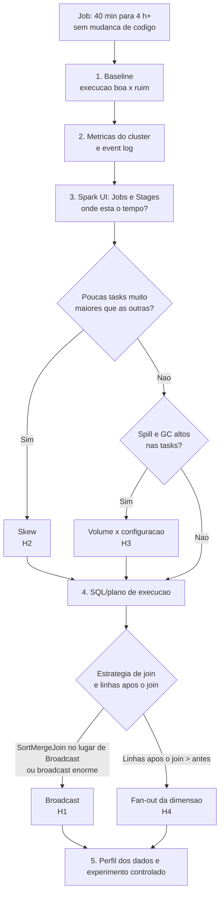

# desafio_tecnico

# Projeto NioMetal S.A. - Desafio Técnico

# Índice

- [Parte 1 — Arquitetura Medallion — Plataforma NioMetal S.A.](#parte-1--arquitetura-medallion--plataforma-niometal-sa)
- [Parte 2 — Pipeline PySpark](#parte-2--pipeline-pyspark)
- [Parte 3 — SQL Avançado](#parte-3--sql-avançado)
- [Parte 4 — Troubleshooting e Performance](#parte-4--troubleshooting-e-performance)
- [Parte 5 — Integração e nuvem](#parte-5--integração-e-nuvem)
- [Parte 6 — Uso Crítico de Ferramentas de IA](#parte-6--uso-crítico-de-ferramentas-de-ia)
- [Referências](#referências)

# Parte 1 — Arquitetura Medallion — Plataforma NioMetal S.A.

<a href="https://github.com/RaphaelVelloso/desafio_tecnico/blob/main/src/parte-1/diagrama_arquitetura.md" target="_blank">Diagrama Arquitetura</a>



**Princípios que orientam o desenho:**

1. **Bronze é imutável e é a fonte da verdade.** Tudo que está em Silver e Gold pode ser reconstruído a partir dele, e isso viabiliza o reprocessamento histórico (seção 5).
2. **Silver aplica regras de negócio e qualidade.** Ele garante tipos, fuso horário, deduplicação e chaves normalizadas, e registros rejeitados vão para quarentena com motivo, sem descarte silencioso.
3. **Gold é o contrato com o consumidor.** Consumidores leem visões estáveis, e as tabelas físicas por trás podem ser versionadas.
4. **A propriedade é por domínio.** Operações e Financeiro são donos de seus dados, e Data Science acessa por *grants*, sem copiar dados.


## 2. Estratégia de ingestão: batch vs. streaming

| Fonte | SLA | Modo | Por que essa escolha | Alternativa descartada |
| :-- | :-- | :-- | :-- | :-- |
| `sensores_iot.json` | Minutos | **Streaming** (Auto Loader, `trigger(processingTime="1 minute")`) | O fluxo é contínuo e o SLA é de minutos. O Auto Loader escala a descoberta de arquivos (file notification ou listagem incremental, conforme o volume) e o checkpoint dá semântica exactly-once na escrita em Delta. | `availableNow` agendado a cada N minutos é mais barato, mas a latência passa a ser o intervalo do agendamento. Serve se o SLA real for de 5 a 10 min. |
| `producao_moinhos.csv` | Diário / intra-diário | **Batch incremental** (Auto Loader `availableNow`) | Os dados chegam em lotes de arquivo. O checkpoint do Auto Loader processa só arquivos novos e o cluster fica ligado apenas durante a carga. | Ler o diretório inteiro a cada execução reprocessa o histórico. Streaming contínuo mantém cluster ligado sem ganho de SLA. |
| `cadastro_fornecedores.csv` | Diário / semanal | **Batch agendado** de snapshots | O volume é baixo e as mudanças são raras. O histórico é construído na Silver via SCD2. | Streaming não traz ganho para uma dimensão que muda esporadicamente. |
| `eventos_sap.csv` | Mensal | **Batch agendado**: carga diária incremental + fechamento mensal | O relatório é mensal, mas a carga diária evita um pico no fechamento e antecipa a detecção de fornecedores órfãos. | Streaming: a fonte é uma extração em lote de um ERP legado. |

> **Sobre `AvailableNow` e `ProcessingTime`:** são modos diferentes. `processingTime` mantém uma query contínua (baixa latência). `availableNow` processa o que houver e encerra (batch incremental). O desenho usa cada um onde o SLA pede.

### 2.1 sensores_iot

**Bronze** (`bronze.sensores_iot`):
- Append-only do JSON bruto com metadados (`_ingestion_ts`, `_source_file` via `_metadata.file_path`).
- A coluna `_rescued_data` preserva o que não casa com o schema.
- Usar `cloudFiles.schemaHints` só para tipos críticos, e não um `.schema()` completo. Com schema explícito completo o Auto Loader não infere nem evolui.

**Silver** (`silver.sensores_iot`) com **deduplicação em duas camadas**:
- **Caminho quase em tempo real:** `withWatermark("event_ts", "2 hours")` + `dropDuplicatesWithinWatermark(["sensor_id", "event_ts"])`. O estado é limitado pelo watermark. A variante `dropDuplicatesWithinWatermark` (Spark 3.5+ / DBR 13.3+) não exige o event time na lista de colunas, e sem ele o estado de um `dropDuplicates` comum nunca expiraria.
- **Reconciliação diária a partir do Bronze:** um `MERGE` *insert-only* por `(sensor_id, event_ts)` recupera eventos que chegaram depois do watermark. Isso evita perda silenciosa.
- **Por que os dois:** o stream entrega latência baixa. O Bronze guarda tudo, então a reconciliação garante completude sem precisar de um watermark gigante (que faria o estado crescer).

**Gold:** `dash_operacao_sensores` é uma agregação em streaming com janelas de 1 a 5 min, lendo a Silver como stream. Correções históricas propagam via Change Data Feed ou reprocessamento da janela.

### 2.2 producao_moinhos

**Bronze:** o Auto Loader lê o CSV como string (comportamento padrão para formatos texto), com `schemaEvolutionMode=addNewColumns`. Assim a mudança de schema não derruba a carga por tipagem.

**Silver:**
- Converte `data_producao` para UTC. A regra é: offset ou `Z` no valor indica UTC, e sem offset vale o fuso da planta (tabela de fusos por planta).
- Aplica `planta_id = coalesce(planta_id, id_planta)` e faz os *casts* de tipo.
- Envia nulos em `toneladas_produzidas` e linhas malformadas para a **quarentena**, com motivo e arquivo de origem. Nulo não é zero, então não é convertido nem descartado.
- Deduplica pela chave de negócio `(planta_id, moinho_id, data_producao)`, e vence a última ingestão. O `MERGE` é feito em `foreachBatch`, com deduplicação prévia dentro do lote, pois o `MERGE` falha com chaves duplicadas na origem.

### 2.3 cadastro_fornecedores

**Bronze:** guarda cada snapshot com `snapshot_date`.

**Silver `dim_fornecedores`** (SCD Tipo 2):
- Usa `AUTO CDC ... STORED AS SCD TYPE 2` (antigo `APPLY CHANGES INTO`, em Lakeflow Declarative Pipelines) com `SEQUENCE BY` a data de atualização da fonte. A alternativa é um único `MERGE` com chave nula para inserir a nova versão e fechar a antiga na mesma transação.
- `valid_from`/`valid_to` usam a **vigência de negócio** (data da alteração na fonte), não a data da carga. Isso preserva joins point-in-time com eventos históricos.
- A coluna `dados_bancarios` recebe *column mask* (seção 7).

### 2.4 eventos_sap

**Bronze:** mantém os lançamentos brutos, com metadados de lote.

**Silver:**
- **Chave do documento:** `BUKRS + BELNR + GJAHR`. Apenas `BELNR` não é único.
- **Normalização de chaves:** `MATNR` (18 caracteres no ECC) e `LIFNR` seguem a conversão ALPHA do SAP. Valores numéricos recebem `lpad` com zeros, e valores alfanuméricos ficam como estão. `MATNR` é armazenado como string com espaço para 40 caracteres, para não travar uma futura migração para S/4HANA.
- **Fornecedor órfão:** o evento **permanece na Silver** com `fornecedor_valido = false` e é registrado na quarentena/tabela de DQ. Dados financeiros não podem sumir, porque o total precisa reconciliar com o SAP. O relatório Gold mostra "fornecedor não cadastrado" como linha separada. Quando o fornecedor chegar ao cadastro, os eventos são revalidados.

---

## 3. Formato de armazenamento e particionamento

**Formato:** Delta Lake em todas as camadas, como tabelas gerenciadas do Unity Catalog. O Delta dá transações ACID (leitores nunca veem estado parcial), `MERGE` idempotente, time travel e Change Data Feed. O Unity Catalog com *predictive optimization* automatiza `OPTIMIZE` e `VACUUM` quando habilitada.

**Particionamento:** usar **Liquid Clustering** em vez de partições. O Liquid Clustering **não pode ser combinado com partições nem com `ZORDER` na mesma tabela**. Ele também permite trocar as chaves de clustering sem reescrever a tabela. Partições fixas só se justificariam em tabelas com volume da ordem de 1 TB ou mais e partições com pelo menos 1 GB, o que não é o caso de `eventos_sap` ou `producao`.

| Tabela | Clustering | Motivo |
| :-- | :-- | :-- |
| `bronze.*` | Sem clustering, ou `ingestion_date` | Escrita append e leitura por faixa de ingestão (reprocessamento). |
| `silver.sensores_iot` | `event_date, planta_id, sensor_id` | Consultas por período, planta e sensor. |
| `silver.producao` | `data_producao_date, planta_id` | Consultas por período e planta. Volume moderado, então nada de partição. |
| `silver.dim_fornecedores` | `fornecedor_id` | Tabela pequena, acessada por chave. |
| `silver.eventos_sap` | `ano_mes, bukrs` | Relatórios mensais por empresa. |
| `gold.*` | Chaves de consulta do dashboard/relatório | Otimizado por consumidor. |

**Propriedades recomendadas (Silver):**

```sql
CREATE TABLE prod_operacoes.silver.sensores_iot (
  sensor_id STRING NOT NULL,
  planta_id STRING,
  event_ts TIMESTAMP NOT NULL,
  event_date DATE,
  temperatura DOUBLE,
  vibracao DOUBLE,
  consumo_eletrico DOUBLE,
  ingestion_ts TIMESTAMP,
  source_file STRING
)
CLUSTER BY (event_date, planta_id, sensor_id)
TBLPROPERTIES (
  'delta.enableChangeDataFeed' = 'true',
  'delta.columnMapping.mode' = 'name',
  'delta.deletedFileRetentionDuration' = 'interval 30 days'
);
```

- `NOT NULL` e `CHECK` constraints dão enforcement real no Delta. O `nullable=False` de um schema Spark é ignorado em fontes de arquivo.
- Change Data Feed permite propagar correções para o Gold.
- Column mapping habilita renomear ou remover colunas sem reescrever dados, e exige upgrade de protocolo (consumidores precisam de leitores compatíveis).
- Ampliar `deletedFileRetentionDuration` (padrão de 7 dias) amplia a janela de time travel e de `RESTORE`.

---

## 4. Schema evolution (`planta_id` → `id_planta`)

1. **Bronze absorve a mudança.** O Auto Loader usa `schemaLocation` e `addNewColumns`, com todas as colunas como string. Quando `id_planta` aparece, o stream **falha uma vez** (`UnknownFieldException`) e, ao reiniciar, segue com o schema evoluído. Por isso o Job precisa de **retry** (pelo menos 1), para não exigir intervenção manual. Tipos incompatíveis vão para `_rescued_data`.
2. **Silver normaliza.** `planta_id = coalesce(planta_id, id_planta)` e depois descarta `id_planta`. O Bronze permanece fiel à origem, e a Silver mantém um contrato único, então os consumidores nunca veem a mudança.
3. **Mudanças controladas do nosso lado** (renomear uma coluna da Silver, por exemplo) usam *column mapping* (`ALTER TABLE ... RENAME COLUMN`), que é uma operação de metadados.
4. **Detecção:** todo evento de evolução de schema gera alerta, e um teste de contrato no CI valida o schema esperado da Silver.

---

## 5. Reprocessamento histórico sem downtime

**Base técnica:**
- O Bronze é imutável e a Silver é reconstruível de forma determinística e idempotente (`MERGE` por chave de negócio).
- O Delta dá isolamento por snapshot: quem está lendo continua vendo a versão anterior até o commit.
- Consumidores (BI, Data Science, Financeiro) leem **views estáveis**, e as tabelas físicas por trás podem ser versionadas.



| Cenário | Estratégia | Por que não causa downtime |
| :-- | :-- | :-- |
| **A. Correção de uma janela** (poucos dias) | `MERGE` ou `replaceWhere` **na própria tabela**, lendo do Bronze. | Commit atômico com isolamento por snapshot. Downstream em streaming deve usar Change Data Feed ou `skipChangeCommits`, porque commits de overwrite/update quebram uma leitura em streaming que espera só appends. |
| **B. Mudança de lógica com reconstrução total** | *Blue/green*: constrói a tabela `v2` em paralelo e valida contra `v1`. Depois faz `CREATE OR REPLACE VIEW` para apontar a view de serviço para `v2`. | A troca da view é uma operação de metadados atômica. Os consumidores nunca deixam de ter dados. |
| **C. Idem, com stream no meio da cadeia** (Silver → Gold em streaming) | Reconstrói Silver `v2` e Gold `v2` **em paralelo**, cada um com seu checkpoint. Um stream ao vivo escreve em `v2` a partir do ponto de corte (`startingVersion` ou `startingTimestamp` do Bronze). A troca de view acontece na **borda de consumo (Gold)**. | Streaming não lê de views, então o swap fica na borda e não entre Silver e Gold. |
| **D. Rollback** | Reapontar a view para `v1`, ou `RESTORE TABLE ... TO VERSION AS OF`. | O rollback via time travel só funciona dentro da retenção configurada (`deletedFileRetentionDuration`, `logRetentionDuration`). |

**Cuidados:**
- **Compute isolado:** o backfill roda em cluster/serverless próprio para não competir com os workloads de SLA.
- **Validação antes do swap:** comparar contagem de linhas, somas de `toneladas_produzidas` e `valor`, e resultados de DQ entre `v1` e `v2`.
- **Retenção da landing zone:** os arquivos brutos devem ficar retidos por pelo menos o horizonte de reprocessamento aceito (política de lifecycle).
- **Sem reset do checkpoint do stream ao vivo:** o backfill usa checkpoint próprio.

---

## 6. Volumetria crescente

- **Ingestão:** o Auto Loader (com file notification em alto volume) escala a descoberta de arquivos sem listar o diretório inteiro.
- **Layout:** Liquid Clustering e *predictive optimization* mantêm o layout sem particionar demais. Otimizar a escrita (`optimizeWrite`, compactação automática) reduz small files.
- **Compute:** compute separado por workload (streaming de sensores, batch de produção, backfill). O batch usa `availableNow` para pagar só pelo tempo de execução.
- **Custo de armazenamento:** política de lifecycle move o raw antigo para camadas mais baratas.
- **Monitoramento:** acompanhar número de arquivos e tamanho médio por tabela para detectar degradação de layout.

---

## 7. Governança de acesso (Unity Catalog)

**Estrutura:**
- **Um metastore** por região, com workspaces por ambiente.
- **Catálogo por domínio e ambiente:** `prod_operacoes`, `prod_financeiro`, `prod_datascience` (e equivalentes `dev_` e `stg_`).
- **Schemas por camada:** `bronze`, `silver`, `gold`, mais `quarentena` e `governance` (funções de máscara e filtros).
- **Sem cópia de dados entre domínios.** Data Science recebe *grants* sobre Silver e Gold de Operações, em vez de ter uma segunda cópia da Silver.
- **Grupos sincronizados do IdP:** `grp_engenharia_dados`, `grp_operacoes`, `grp_financeiro`, `grp_datascience`. Os jobs rodam como **service principal**, não como usuário pessoal.
- **Ownership por grupo**, não por pessoa.

**Matriz de acesso (mínimo privilégio):**

| Schema | Engenharia (service principal) | Operações | Financeiro | Data Science |
| :-- | :-- | :-- | :-- | :-- |
| `prod_operacoes.bronze` | MODIFY | — | — | — |
| `prod_operacoes.silver` | MODIFY | SELECT | — | SELECT |
| `prod_operacoes.gold` | MODIFY | SELECT | — | SELECT |
| `prod_financeiro.bronze` | MODIFY | — | — | — |
| `prod_financeiro.silver` | MODIFY | — | SELECT | — (via view sem dados sensíveis, sob aprovação) |
| `prod_financeiro.gold` | MODIFY | — | SELECT | — |
| `prod_datascience.*` | — | SELECT nos resultados publicados | — | ALL PRIVILEGES |

**Por que o Bronze fica fechado:** ele contém dados brutos, com duplicatas, fusos misturados e valores não validados. Expô-lo a usuários de negócio gera análises erradas e amplia a superfície de dados sensíveis.

**Segurança fina:**

```sql
-- Column mask: dados bancarios so aparecem para auditoria financeira
CREATE OR REPLACE FUNCTION prod_financeiro.governance.mask_dados_bancarios(v STRING)
RETURNS STRING
RETURN CASE WHEN is_account_group_member('grp_financeiro_auditoria') THEN v ELSE '****' END;

ALTER TABLE prod_financeiro.silver.dim_fornecedores
  ALTER COLUMN dados_bancarios SET MASK prod_financeiro.governance.mask_dados_bancarios;

-- Row filter: usuario operacional enxerga apenas as plantas do seu grupo
CREATE OR REPLACE FUNCTION prod_operacoes.governance.filtro_planta(p STRING)
RETURNS BOOLEAN
RETURN is_account_group_member('grp_operacoes_global')
    OR is_account_group_member(CONCAT('grp_planta_', p));

ALTER TABLE prod_operacoes.silver.producao SET ROW FILTER prod_operacoes.governance.filtro_planta ON (planta_id);
```

- **Armazenamento:** o acesso a arquivos é feito só por *external locations* e *storage credentials* do Unity Catalog. Nenhum usuário acessa o storage diretamente, e a landing zone é lida apenas pelo service principal de ingestão.
- **Classificação:** tags de sensibilidade (`dados_bancarios`, `financeiro`) apoiam auditoria e políticas.
- **Auditoria e linhagem:** as system tables (`system.access.audit`, `system.access.table_lineage`, `system.access.column_lineage`) e o histórico do Delta sustentam a auditoria da dimensão de fornecedores, que o enunciado destaca.

---

## 8. Qualidade de dados e observabilidade

- **Regras de qualidade** (nulos, faixas, chaves, integridade referencial) declaradas como *expectations* (Lakeflow Declarative Pipelines) ou em módulo reutilizável, com política por regra: `warn`, `drop para quarentena` ou `fail`.
- **Quarentena:** cada registro rejeitado guarda o payload, o motivo, o arquivo de origem e o timestamp, o que permite análise e reprocessamento.
- **Frescor e SLA:** alerta quando `max(ingestion_ts)` de uma tabela ultrapassa o SLA da fonte. Job com falha, duração acima do esperado e evento de evolução de schema também alertam.
- **Orquestração:** Databricks Workflows (Lakeflow Jobs) com retries, dependências e notificações.

---

<small><a href="#indice">⬆️ Voltar ao topo</a></small>

---

# Parte 2 — Pipeline PySpark

## 1. Problemas Técnicos Identificados no Código Original

   | Arquivo | Conteúdo |
   | :-- | :-- |
   | `common.py` | Logging estruturado, contrato de schema, retry de evolução de schema |
   | `pipeline_producao_moinhos.py` | Landing → Bronze → Silver de produção, com quarentena |
   | `scd2_fornecedores.py` | Dimensão de fornecedores em SCD Tipo 2 |
   | `dedup_sensores_iot.py` | Deduplicação dos sensores (stream + reconciliação) |

   | # | Problema | Causa e impacto | Como o código novo resolve |
   | :-- | :-- | :-- | :-- |
   | 1 | `df.collect()` | Traz **todas** as linhas para a memória do driver. Com volume real causa OOM e anula o processamento distribuído. | Nenhuma ação traz dados ao driver; tudo é DataFrame/streaming. |
   | 2 | Loop `for` em Python para filtrar | Executa linha a linha em um único processo. O que um `filter` distribuído faz em paralelo vira trabalho sequencial. | Filtros e validações são expressões Spark (`F.when`, `F.filter`). |
   | 3 | `spark.createDataFrame(resultado)` | Reenvia os dados do driver ao cluster e **reinfere o schema** a partir de objetos Python. Com lista vazia falha ("can not infer schema from empty dataset"). | O DataFrame nunca sai do Spark; os tipos vêm de `try_cast` explícito. |
   | 4 | Leitura sem schema | `csv(header=True)` sem `inferSchema` lê **tudo como string**, então `toneladas_produzidas` nunca é validada como número. Os nomes de coluna vêm de um único header. | Bronze em string (não falha por tipagem); Silver com tipos via `try_cast`, contrato de colunas e constraints Delta (ver seção 2). |
   | 5 | `mode('overwrite')` a cada execução | Reescreve a tabela inteira (custo crescente) e **não é incremental**. Se o raw for rotacionado, o histórico some. Commits de overwrite também quebram consumidores em streaming que esperam só appends. Obs.: o overwrite do Delta é atômico, então não causa downtime. | Auto Loader processa só arquivos novos; MERGE idempotente por chave de negócio. |
   | 6 | Sem deduplicação | O dataset traz linhas duplicadas e horários em fusos diferentes; ambos passam direto para a Silver. | Normalização para UTC e deduplicação por `(planta, moinho, instante UTC)`. |
   | 7 | Descarte silencioso de nulos | Registros sem `toneladas_produzidas` somem sem rastro: sem contagem, sem motivo, sem como reprocessar. | Quarentena com payload, motivos, arquivo de origem e timestamp. |
   | 8 | Sem tratamento de erros nem logging | Falha de leitura ou escrita não deixa evidência e não há métrica para alertar. | Log JSON por micro-batch e exceção propagada (o Job falha e aciona retry/alerta). |
   | 9 | Caminhos `/mnt/...` hardcoded e escrita por path | Montagens DBFS não são governadas pelo Unity Catalog (sem lineage, sem permissões finas) e o código não é promovível entre ambientes. | Volumes/tabelas do Unity Catalog e parâmetros do Job. |
   | 10 | Raw → Silver direto, sem Bronze | Sem uma cópia imutável do dado original, corrigir uma regra exige reler o raw (que pode ter sido rotacionado). | Landing → Bronze append-only → Silver. |
   | 11 | `carregar_fornecedores` com `overwrite` | Destrói o histórico de mudanças (endereço, status, dados bancários), que o enunciado diz ser necessário para auditoria. | SCD Tipo 2 (seção 3). |
   | 12 | Funções sem parâmetros e dependentes de `spark` global | Não é testável nem reutilizável. | `Config` e argumentos do Job; funções puras que recebem `spark`/DataFrame. |


## 2. Pipeline Refatorado de Produção (`producao_moinhos.csv`)


### Como cada requisito do enunciado é atendido

| Requisito | Implementação | Por quê |
| :-- | :-- | :-- |
| **Leitura escalável (sem `collect()`)** | Auto Loader no Bronze; Delta como fonte de streaming no Silver. | O processamento fica distribuído e o volume de dados não é limitado pela memória do driver. |
| **Enforcement de schema** | (1) `assert_required_columns` falha rápido se o Bronze perder colunas essenciais; (2) `try_cast` para `TIMESTAMP` e `DECIMAL(18,3)` — valor inválido vira `NULL` e a linha vai para a quarentena; (3) `NOT NULL` e `CHECK (toneladas_produzidas >= 0)` na tabela Silver. | Não usei `spark.read.schema(...)` em CSV porque, com `enforceSchema=true` (padrão), o Spark ignora os nomes do header e mapeia por **posição**: a mudança `planta_id` → `id_planta` (ou qualquer reordenação) passaria em silêncio. O `nullable=False` de um schema Spark também é ignorado em fontes de arquivo; o enforcement real está nas constraints do Delta. |
| **Tratamento de erros e logging** | `log_event` em JSON por micro-batch (lidos, rejeitados, duplicados removidos, segundos); `logger.exception` + `raise`. | Propagar o erro faz o Job falhar, acionar retry e alerta. O checkpoint garante que nada se perde, e o MERGE é idempotente, então reprocessar é seguro. |
| **Carga incremental** | Checkpoint do Auto Loader (arquivos) e do stream Delta (offsets do Bronze). | Cada execução processa só o que é novo. |
| **Idempotência** | MERGE por `(planta_id, moinho_id, data_producao_utc)`; `whenMatchedUpdateAll` só se `s._ingestion_ts > t._ingestion_ts`; escrita idempotente da quarentena (`txnAppId` + `txnVersion`). | Reexecutar o mesmo lote ou reprocessar um arquivo não duplica linhas nem sobrescreve dado mais novo por um mais antigo. |

### Decisões e trade-offs

- **`foreachBatch` + MERGE** em vez de um MERGE em cima da leitura completa do Bronze. O checkpoint entrega só o novo, e o MERGE por chave torna a reexecução de um lote segura (o `foreachBatch` tem semântica at-least-once).
- **Sessão em UTC** (`spark.sql.session.timeZone = UTC`): o parse de strings sem offset passa a ser "literal", e a conversão de horário local para UTC fica explícita em `to_utc_timestamp`. Assim o resultado não depende da configuração do cluster.
- **Deduplicar depois de normalizar para UTC:** a mesma leitura escrita em UTC num arquivo e em horário local em outro só é reconhecida como duplicata quando ambas estão no mesmo fuso.
- **Custo:** `persist()` do lote e algumas ações (`count`) por micro-batch. É aceitável para observabilidade e evita recomputar a normalização.
- **Limitação conhecida:** `txnVersion` usa o `batch_id`, que reinicia se o checkpoint for recriado. Após recriar o checkpoint, use um novo `txnAppId`.

### Premissas (ver registro de suposições no README)

- A mudança `planta_id` → `id_planta` ocorre **entre arquivos**.
- Timestamp com offset ou `Z` é UTC; sem offset é horário local da planta (padrão `America/Sao_Paulo`, configurável por planta).
- Ponto decimal `.` em `toneladas_produzidas`.
- A chave de negócio é `(planta_id, moinho_id, instante)`; a coluna de data se chama `data_producao`.

---

## 3. Dimensão de fornecedores — SCD Tipo 2

### Modelo

| Coluna | Papel |
| :-- | :-- |
| `fornecedor_id` | Chave de negócio |
| `nome`, `endereco`, `status_contratual`, `dados_bancarios` | Atributos versionados |
| `attribute_hash` | SHA-256 do JSON dos atributos (detecta mudança sem comparar coluna a coluna) |
| `valid_from` / `valid_to` | Vigência em intervalo **semiaberto** `[valid_from, valid_to)`; `valid_to` é `NULL` na versão corrente |
| `is_current` | Facilita consultas à versão atual |

Exemplo: o fornecedor F1 muda de endereço em 2026-03-01.

| fornecedor_id | endereco | valid_from | valid_to | is_current |
| :-- | :-- | :-- | :-- | :-- |
| F1 | Rua A, 10 | 2025-01-10 | 2026-03-01 | false |
| F1 | Rua B, 20 | 2026-03-01 | NULL | true |

### Algoritmo (um único MERGE)

1. Limpa os atributos (`trim`, vazio vira `NULL`) e calcula `attribute_hash`.
2. Mantém **uma linha por fornecedor** no snapshot (a mais recente).
3. Identifica os fornecedores **alterados**: existem como corrente, o hash difere e a vigência da fonte é maior que a `valid_from` atual.
4. Monta o lote do MERGE: todos os fornecedores com `merge_key = fornecedor_id` **mais** uma segunda cópia dos alterados com `merge_key = NULL`.
5. `MERGE ... ON t.fornecedor_id = s.merge_key AND t.is_current = true`:
   - **Casou e mudou:** fecha a versão (`valid_to = vigência nova`, `is_current = false`).
   - **Não casou:** insere. Isso cobre fornecedor novo (`merge_key = id`) e a nova versão dos alterados (`merge_key = NULL`, que nunca casa).

**Por que um único MERGE?** Fechar e inserir na mesma transação Delta evita o estado "fornecedor sem versão corrente" que uma falha entre dois comandos deixaria, e os intervalos ficam contíguos porque a `valid_to` antiga é igual à `valid_from` nova.

**Por que o hash usa `to_json(struct(...))`?** `concat_ws` ignora NULLs, então `("A", NULL, "B")` e `("A", "B", NULL)` gerariam o mesmo texto e a mudança passaria despercebida. O JSON preserva o nome de cada campo. O sal opcional (`--salt`, vindo de secret scope) dificulta reverter o hash por força bruta.

**Idempotência:** reexecutar o mesmo snapshot não muda nada, porque o hash é igual ao da versão corrente. Um snapshot atrasado não regride a dimensão, por causa da guarda `vigencia_ts > valid_from`.

**Ordem:** se um micro-batch tiver mais de um snapshot, eles são aplicados em ordem cronológica, um MERGE por snapshot, para preservar as versões intermediárias.

### Validações (rodar após cada carga)

```sql
-- 1. Exatamente uma versão corrente por fornecedor (deve retornar 0 linhas)
SELECT fornecedor_id
FROM prod_financeiro.silver.dim_fornecedores
GROUP BY fornecedor_id
HAVING SUM(CAST(is_current AS INT)) <> 1;

-- 2. Sem sobreposição nem buraco entre versões (deve retornar 0 linhas)
SELECT fornecedor_id, valid_from, valid_to, prox_from
FROM (
  SELECT fornecedor_id, valid_from, valid_to,
         LEAD(valid_from) OVER (PARTITION BY fornecedor_id ORDER BY valid_from) AS prox_from
  FROM prod_financeiro.silver.dim_fornecedores
)
WHERE prox_from IS NOT NULL AND valid_to <> prox_from;
```

### Limitações e decisões em aberto

- **Remoções:** um fornecedor que some do snapshot não é encerrado. Tratar isso exige decidir se o arquivo é um retrato completo e como representar "inativo" (extensão possível: `whenNotMatchedBySourceUpdate`).
- **Vigência de negócio:** vem da coluna `data_atualizacao`. Sem ela, usa a data do snapshot, o que perde precisão se houver várias mudanças entre snapshots.
- **Chave substituta (surrogate key):** não incluí uma coluna `IDENTITY`, pois ela restringe transações concorrentes. Se o modelo dimensional exigir, pode ser adicionada.
- **`dados_bancarios`:** fica em claro na Silver e é protegido por *column mask* do Unity Catalog (ver Parte 1).

---

## 4. Deduplicação das leituras dos sensores (fora de ordem)

### O problema

As leituras chegam fora de ordem (*late-arriving*) e algumas se repetem por falha de rede. Deduplicar não exige ordenar os eventos, exige **reconhecer que dois registros são a mesma leitura** sem guardar estado para sempre.

### Estratégia

1. **Identidade da leitura:** `(sensor_id, event_ts)` ou, se a fonte trouxer um identificador, `(sensor_id, event_id)`. O `event_ts` é o **event time** (quando a leitura ocorreu), não o horário de chegada.
2. **Watermark sobre o event time:** `withWatermark("event_ts", "2 hours")` limita o estado do Spark. O Spark só guarda chaves dentro da janela de atraso aceita.
3. **`dropDuplicatesWithinWatermark`:** remove duplicatas dentro do watermark e expira o estado junto com ele. Um `dropDuplicates` comum que **não** inclua o event time na chave manteria o estado para sempre (crescimento ilimitado); com o event time na chave o estado é limpo, e a variante `WithinWatermark` dispensa essa exigência.
4. **Bronze guarda tudo:** o stream descarta leituras mais atrasadas que o watermark, o que seria perda silenciosa. Por isso o Bronze é append-only e completo.
5. **Reconciliação periódica:** um `MERGE` *insert-only* a partir do Bronze insere na Silver o que faltar (leituras atrasadas demais para o stream), sem alterar o que já existe.



### Alternativas consideradas

| Alternativa | Vantagem | Desvantagem | Decisão |
| :-- | :-- | :-- | :-- |
| `dropDuplicates` sem watermark | Simples | Estado cresce sem limite; o job degrada e eventualmente falha | Descartada |
| Watermark grande (dias) | Cobre quase todo atraso | Estado enorme, alto custo e checkpoint pesado | Descartada |
| Só MERGE em cada micro-batch | Sem estado; aceita qualquer atraso | MERGE a cada minuto é caro e concorre com o stream | Usado só na reconciliação |
| **Stream com watermark + reconciliação** | Baixa latência **e** completude | Duas rotas para manter | **Escolhida** |

### Como dimensionar o watermark

Meça o atraso real no Bronze e escolha um percentil alto (p99) como ponto de partida:

```sql
SELECT percentile_approx(
         unix_timestamp(_ingestion_ts) - unix_timestamp(CAST(`timestamp` AS TIMESTAMP)),
         array(0.5, 0.95, 0.99, 0.999)) AS atraso_segundos
FROM prod_operacoes.bronze.sensores_iot;
```

O valor de 2 h no código é **provisório** até essa medição. Se o p99 for de poucos minutos, um watermark de 15 a 30 minutos reduz estado e custo.

### Como monitorar

No `lastProgress` do stream, acompanhe `stateOperators[0].numRowsTotal` (o estado deve se estabilizar) e `numRowsDroppedByWatermark` (leituras que a reconciliação terá de recuperar).

### Limitações

- Duas leituras com a mesma chave e **valores diferentes** (falha do sensor) ficam com a primeira ingerida. Se isso importar, a regra de desempate precisa ser definida com o negócio.
- Linhas sem `sensor_id` ou sem timestamp permanecem no Bronze e não chegam à Silver. Em produção, devem gerar métrica e alerta.
- A reconciliação e o stream escrevem na mesma tabela; conflitos de concorrência são esperados e tratados com nova tentativa.

<small><a href="#indice">⬆️ Voltar ao topo</a></small>

---

# Parte 3 — SQL Avançado

Arquivos (em `src/parte-3/`):

| Arquivo | Consulta |
| :-- | :-- |
| `01_maior_queda_mensal.sql` | Top 3 moinhos com maior queda percentual mês a mês (últimos 6 meses) |
| `02_anomalias_media_movel.sql` | Dias que ultrapassam 2 desvios-padrão da média móvel de 7 dias |
| `03_integridade_referencial_fornecedores.sql` | Eventos SAP com fornecedor inexistente, agrupados por mês |

## Premissas e mapeamento de nomes

As consultas usam os nomes do enunciado. Elas se conectam à arquitetura assim:

| Nome na consulta | Tabela da arquitetura (Partes 1 e 2) | Observação |
| :-- | :-- | :-- |
| `silver.producao` | `prod_operacoes.silver.producao` | A coluna `data` corresponde a `data_producao_date` (tipo `DATE`, em UTC). |
| `silver.eventos_sap` | `prod_financeiro.silver.eventos_sap` | `data` é a data do lançamento. |
| `silver.dim_fornecedores` | `prod_financeiro.silver.dim_fornecedores` | É o `cadastro_fornecedores` do enunciado, já como SCD Tipo 2. |

---

## Consulta 1 — Maiores quedas percentuais mês a mês

**Interpretação:** para cada moinho, considera-se a **pior queda mensal** dentro dos últimos 6 meses. Os moinhos são ranqueados por essa queda e os 3 primeiros são retornados. Outras leituras possíveis (queda média, queda entre o primeiro e o último mês) exigem trocar apenas a métrica do ranking.

### Como funciona

1. **`parametros`:** define o mês corrente. A janela termina no **último mês completo**.
2. **`calendario`:** gera 7 meses completos (1 mês-base + 6 avaliados) com `sequence`.
3. **`serie`:** cruza cada moinho com cada mês do calendário. Sem linhas em um mês, a produção é 0.
4. **`variacao`:** `LAG` traz a produção do mês anterior, por `(planta_id, moinho_id)`.
5. **`quedas`:** calcula `(anterior − atual) / anterior × 100`, mantendo só quedas reais.
6. **`pior_mes_por_moinho` e `ranking`:** dois `ROW_NUMBER`. O primeiro escolhe o pior mês de cada moinho, e o segundo ordena os moinhos.

### Decisões e o problema que cada uma evita

| Decisão | Problema evitado |
| :-- | :-- |
| Excluir o mês corrente | Um mês parcial comparado a um mês cheio produz uma "queda" falsa gigantesca. |
| Filtro em início de mês (`add_months(mes_corrente, -7)`) e não `ADD_MONTHS(CURRENT_DATE(), -6)` | Cortar no meio do mês deixa o primeiro mês da janela parcial. |
| Calendário de meses (sem buracos) | Sem ele, se um moinho não tem nenhuma linha em um mês, o `LAG` compara com **dois meses atrás** e esconde a parada. |
| Chave `(planta_id, moinho_id)` | O mesmo `moinho_id` pode existir em plantas diferentes; agrupar só por `moinho_id` mistura moinhos distintos. |
| `toneladas_mes_anterior > 0` | Evita divisão por zero e crescimento "infinito" na partida de um moinho. |
| `toneladas < toneladas_mes_anterior` | Sem esse filtro, moinhos que só cresceram apareceriam no top 3 se poucos moinhos tivessem queda. |
| `ROW_NUMBER` com desempate por `planta_id, moinho_id` | Garante exatamente 3 linhas e resultado determinístico. Para incluir empates, use `RANK`. |

**Semântica assumida:** mês sem nenhum registro conta como produção 0 (moinho parado). Se ausência de registro significar "dado não recebido" em vez de "parado", essa regra gera falsos alertas de 100% de queda e deve ser revista com o negócio.

**Desempenho:** o filtro por `data` aproveita o Liquid Clustering da Silver (`data_producao_date`). O calendário multiplica apenas por 7 meses, então o custo extra é desprezível.

---

## Consulta 2 — Anomalias com média móvel de 7 dias

**Regra:** um dia é anômalo quando `|produção − média_7d| > 2 × desvio_7d`, em que média e desvio usam os **7 dias corridos anteriores**, sem incluir o próprio dia.

### Como funciona

1. **`producao_diaria`:** consolida registros do mesmo dia e cria `dia_num` (número do dia), para permitir um `RANGE` numérico.
2. **`estatisticas`:** `AVG`, `STDDEV_SAMP` e `COUNT` sobre a janela `RANGE BETWEEN 7 PRECEDING AND 1 PRECEDING`.
3. **Filtro final:** aplica o limiar de 2 desvios e as guardas.

### Decisões

| Decisão | Motivo |
| :-- | :-- |
| Janela **exclui o próprio dia** | Se o pico entrasse na média e no desvio, ele inflaria o limite e mascararia a si mesmo. |
| **`RANGE` sobre o número do dia**, não `ROWS` | Com dias faltando na série, `ROWS BETWEEN 7 PRECEDING` abrangeria mais de 7 dias de calendário. O `RANGE` numérico usa dias corridos e dispensa um calendário auxiliar. |
| `STDDEV_SAMP` (amostral) | A janela é uma amostra dos dias, não a população inteira. |
| Anomalia **nos dois sentidos** (`ACIMA` / `ABAIXO`) | Uma queda brusca de produção é tão relevante quanto um pico. Para a leitura estritamente literal do enunciado ("ultrapassa"), filtre `tipo_anomalia = 'ACIMA'`. |
| `dias_na_janela >= 5` | Com poucos pontos, o desvio é ruído. O limite é parametrizável em `parametros`. |
| `desvio_7d > 0` | Com desvio 0, qualquer variação mínima seria "anômala". Limitação: uma produção constante que muda de repente não é sinalizada; uma tolerância absoluta mínima resolveria, se o negócio quiser. |

---

## Consulta 3 — Integridade referencial de fornecedores

### 3a — Fornecedor inexistente, por mês

`NOT EXISTS` sobre a chave normalizada, agrupando por `trunc(data, 'MM')`. Retorna, por mês: registros órfãos, documentos afetados, fornecedores inexistentes, valor total afetado e até 5 exemplos de `fornecedor_id` para triagem.

| Decisão | Motivo |
| :-- | :-- |
| "Existe" = chave em **qualquer versão** da dimensão | Filtrar `is_current = true` mediria o estado de hoje, e não a integridade da chave. |
| **`NOT EXISTS`**, não `NOT IN` | `NOT IN` retorna **zero linhas** se a subconsulta tiver um `NULL`, e o problema passaria despercebido. |
| FK nula **não** é violação | Um evento sem fornecedor não referencia ninguém. Ele é reportado à parte (3b), pois pode ser um lançamento legítimo sem fornecedor ou um problema de extração. |
| Normalização da chave nos dois lados (conversão ALPHA do SAP) | Zeros à esquerda (`'0000012345'` vs `'12345'`) são causa clássica de falso órfão. A Silver já normaliza; aqui é uma defesa. Para auditar divergências de formato em vez de mascará-las, remova a normalização. |
| `COUNT(DISTINCT bukrs, belnr)` | `BELNR` só é único por empresa (e ano fiscal, `GJAHR`, se a tabela o tiver; nesse caso inclua-o). |

### 3b — Eventos sem fornecedor (informativo)

Contagem e valor de eventos com `fornecedor_id` nulo ou em branco, por mês. Serve para dimensionar o que ficou fora da 3a.

### 3c — Validade temporal (opcional)

Detecta eventos cujo fornecedor existe, mas **não estava vigente na data do evento**, usando o intervalo semiaberto `[valid_from, valid_to)` da dimensão SCD2.

**Cuidado:** só é confiável se `valid_from` refletir a **vigência de negócio** (a coluna `data_atualizacao`, como na Parte 2). Se a dimensão foi carregada usando a data do snapshot como vigência, todo evento anterior ao primeiro snapshot será sinalizado. Por isso esta consulta é opcional.

**Desempenho:** a dimensão é pequena, então o `NOT EXISTS` vira um anti-join com broadcast. O filtro por mês aproveita o clustering de `eventos_sap`.

---

## Cenários que o dataset deve cobrir

Cada caso tem um resultado esperado conhecido, o que transforma a execução em evidência de que a consulta está correta.

| Consulta | Cenário | Resultado esperado |
| :-- | :-- | :-- |
| 1 | Moinho com queda de 50% em um mês | Aparece no top 3 com 50% |
| 1 | Moinho com um mês sem nenhum registro | Queda de 100% nesse mês |
| 1 | Registros no mês corrente (parcial) | Ignorados |
| 1 | Mesmo `moinho_id` em duas plantas | Tratados como moinhos distintos |
| 1 | Mês com todas as toneladas nulas | Não gera comparação |
| 1 | Moinho que só cresce | Não aparece |
| 2 | Pico e queda brusca em série estável | Ambos sinalizados (`ACIMA` e `ABAIXO`) |
| 2 | Dias faltando na série | Janela continua em 7 dias corridos |
| 2 | Produção constante | Nenhum alerta (desvio 0) |
| 2 | Menos de 5 dias de histórico | Nenhum alerta |
| 3 | Fornecedor `'0000012345'` no evento e `'12345'` na dimensão | Não é órfão |
| 3 | Fornecedor com todas as versões encerradas | Não é órfão (3a) |
| 3 | Fornecedor inexistente em dois meses diferentes | Uma linha por mês na 3a |
| 3 | `fornecedor_id` nulo ou em branco | Fora da 3a, contado na 3b |
| 3 | Mesmo `belnr` em duas empresas | Contados como documentos distintos |

---


   <a href="https://github.com/RaphaelVelloso/desafio_tecnico/blob/main/src/parte-3/silver.eventos_sap.sql" target="_blank">Codigo SQL para os 3 topicos</a>

<small><a href="#indice">⬆️ Voltar ao topo</a></small>

---

# Parte 4 — Troubleshooting e Performance

   Ao investigar uma degradação severa sem alteração de código, a investigação deve ir do nível macro (infra/recursos) para o nível micro (execução de DAG/código)


## 0. Enquadramento: o que pode mudar quando "o código não mudou"

Sem mudança de código, só três coisas podem ter mudado. Isso organiza toda a investigação:

| Domínio | Exemplos | Relação com o enunciado |
| :-- | :-- | :-- |
| **Dados** | Volume, distribuição das chaves (skew), tamanho e número de versões da dimensão, quantidade e tamanho de arquivos | O cadastro "cresceu bastante" |
| **Ambiente** | Versão do Databricks Runtime, configurações do Spark, estatísticas das tabelas | Não citado; precisa ser descartado |
| **Infraestrutura** | Autoscaling, instâncias spot perdidas, concorrência com outros jobs, throttling do storage | Autoscaling de 2 a 8 workers |

**Um raciocínio de ordem de grandeza:** uma piora de ~6x (40 min → 4 h) raramente vem de uma causa linear (dados 6x maiores). Costuma vir de um **ponto de inflexão** (a tabela deixou de caber no broadcast, passou a haver *spill* em disco) ou de um **gargalo serial** (uma única tarefa muito maior que as demais). Por isso as hipóteses abaixo procuram esses dois padrões.

---

## 1. Diagnóstico: passos em ordem

A ordem vai do **barato e amplo** ao **caro e específico**: cada passo descarta hipóteses e diz onde olhar no seguinte.



| # | Passo | Onde olhar | Sinal a procurar | O que decide |
| :-- | :-- | :-- | :-- | :-- |
| 1 | **Baseline: o que é diferente entre a execução boa e a ruim?** | Histórico de execuções do Job (duração por tarefa), versão do Runtime, configuração do cluster, tamanho da entrada, `DESCRIBE DETAIL` e `DESCRIBE HISTORY` da dimensão | Entrada muito maior, dimensão com muito mais linhas/versões, Runtime ou configuração diferentes, outro job no mesmo cluster | Aponta o domínio (dados, ambiente ou infraestrutura) antes de abrir a Spark UI |
| 2 | **Métricas do cluster e event log** | Aba de métricas do cluster (CPU, memória, rede, disco) e event log (`RESIZING`, `NODES_LOST`, `DRIVER_NOT_RESPONDING`) | O autoscaling chegou a 8 workers? Nós perdidos (spot)? CPU **baixa** durante um job longo? | CPU baixa por horas indica gargalo serial (skew ou trabalho no driver); CPU/memória saturadas indicam capacidade ou *spill* |
| 3 | **Spark UI, Jobs e Stages: onde está o tempo?** | Linha do tempo de jobs e a lista de stages ordenada por duração | Um ou poucos stages concentram quase todo o tempo? Há **lacunas** entre jobs (trabalho do driver)? Jobs iniciais lendo toda a entrada (inferência de schema)? | Isola o(s) stage(s) responsáveis, para não otimizar o que não importa |
| 4 | **Detalhe do stage lento: distribuição das tasks** | *Summary Metrics* do stage: duração min/mediana/máx, *Spill* (memória e disco), *GC Time*, *Shuffle Read Size*; tasks com retentativa | Máx ≫ mediana (skew). *Spill* em quase todas as tasks (partições grandes demais). GC > 10–20% do tempo (pressão de memória). *Fetch failures* (nós perdidos) | Distingue skew (poucas tasks) de sobrecarga geral (todas as tasks) |
| 5 | **Plano de execução e aba SQL** | `df.explain("formatted")`, aba SQL/DataFrame (plano final do AQE), Query Profile | Estratégia do join (`BroadcastHashJoin` vs `SortMergeJoin`); métricas do `BroadcastExchange` (tamanho e tempo); nº de linhas **antes e depois** do join; arquivos lidos | Confirma H1 e H4 e revela o custo do shuffle |
| 6 | **Logs do driver** | Log4j/driver logs | `BroadcastTimeoutException`, `OutOfMemoryError`, pausas longas de GC | Mostra se o broadcast está sobrecarregando o driver |
| 7 | **Perfil dos dados** | Consultas de distribuição de chaves, tamanho e nº de arquivos | Chaves quentes; muitos arquivos pequenos; chaves duplicadas na dimensão | Fornece a causa, não só o sintoma |
| 8 | **Experimento controlado** | Mesmo job sobre uma amostra ou um dia, mudando **uma variável** por vez | A duração muda ao remover o `broadcast()`, filtrar `is_current`, etc.? | Prova causal antes de alterar produção |

---

## 2. Hipóteses mais prováveis (em ordem)

### H1 — O broadcast join deixou de funcionar como antes porque a dimensão cresceu

O broadcast join só compensa quando o lado pequeno é realmente pequeno: ele é coletado no driver e replicado em todos os executores, então o custo cresce com o tamanho da tabela e com o número de nós. Ao crescer, dois cenários são possíveis:

1. **Sem `broadcast()` explícito:** a tabela passa do limite (padrão de 10 MB no Spark; o Databricks usa limiares próprios com o AQE, então confira no seu Runtime) e o Spark troca para **SortMergeJoin**. Isso exige embaralhar e ordenar a tabela **grande** de sensores, que antes não se movia. É a explicação mais direta para 40 min virar horas: um shuffle completo do lado maior.
2. **Com `broadcast()` forçado:** o hint prevalece sobre o limite. A tabela inteira passa pelo driver e é enviada a todos os executores, gerando pressão de memória e GC, lentidão no `BroadcastExchange` e o risco de `BroadcastTimeoutException` (`spark.sql.broadcastTimeout`, padrão de 300 s) ou de estouro de memória. Há ainda um limite rígido de 8 GB por tabela em broadcast.

**Como confirmar.** No plano, procure `SortMergeJoin` precedido de `Exchange` na tabela de sensores (cenário 1), ou um `BroadcastExchange` com "data size" grande e tempo de coleta alto (cenário 2). Nos logs do driver, procure exceções de broadcast. O tamanho **em disco** (comprimido) subestima o tamanho em memória, então meça o tamanho real no `BroadcastExchange`.

### H2 — Data skew nas transformações *wide*

**Raciocínio.** `groupBy`, `join` e `dropDuplicates` enviam todas as linhas de uma mesma chave para a mesma partição. Dados de sensores são naturalmente desiguais: um sensor com defeito pode enviar milhões de leituras, e picos concentram eventos em poucos timestamps. Sem mudança de código, a **distribuição** dos dados pode ter mudado. O stage só termina quando a **última** tarefa termina, então uma partição desproporcional segura o job inteiro (o gargalo serial descrito na seção 0). O crescimento é pior que linear, porque uma partição grande também vira *spill* em disco.

**Como confirmar.** No stage lento, duração máxima muito maior que a mediana, uma task com *Shuffle Read Size* e *Spill* muito acima das demais, e cluster com CPU ociosa (o autoscaling não ajuda). Consulta de apoio:

```sql
SELECT chave, COUNT(*) AS linhas,
       ROUND(COUNT(*) * 100.0 / SUM(COUNT(*)) OVER (), 2) AS pct_do_total
FROM sensores           -- tabela/DF de entrada
GROUP BY chave          -- sensor_id ou a chave do join/agrupamento
ORDER BY linhas DESC
LIMIT 20;
```

### H3 — Volume maior sobre configuração estática

**Raciocínio.** Com mais dados, configurações que eram adequadas deixam de ser:

- **Partições de shuffle fixas** (padrão de 200): com volume maior cada partição fica grande demais, não cabe na memória e faz *spill* para disco. O AQE consegue **reduzir** partições, mas não aumentar o número inicial.
- **JSON sem schema explícito:** `spark.read.json` sem `.schema()` faz uma **passagem extra sobre todos os arquivos** para inferir o schema. Esse custo cresce linearmente com os dados, sem que o código mude.
- **Muitos arquivos pequenos ou `multiLine`:** listagem e overhead por tarefa crescem; JSON `multiLine` não é divisível, então cada arquivo vira uma tarefa e arquivos maiores viram stragglers.

**Como confirmar.** *Spill* em quase todas as tasks e GC alto. Jobs iniciais lendo toda a entrada sem produzir saída (inferência de schema). Número e tamanho médio dos arquivos lidos na aba SQL.

### H4 — Fan-out por dimensão histórica (SCD Tipo 2)

**Raciocínio.** A dimensão de fornecedores guarda **todas as versões**. Um join apenas pela chave, sem filtrar a versão (`is_current`) nem usar intervalo de vigência, devolve **uma linha por versão**. À medida que a dimensão acumula histórico, o resultado do join se multiplica: mais linhas, mais shuffle e, além da lentidão, **resultados duplicados**. Isso também faz a dimensão crescer e piorar H1.

**Como confirmar.** No plano, o número de linhas de saída do join é **maior** que o da tabela de sensores. Comparar a contagem final com a de uma execução anterior. Conferir chaves repetidas na dimensão:

```sql
SELECT fornecedor_id, COUNT(*) AS versoes
FROM prod_financeiro.silver.dim_fornecedores
GROUP BY fornecedor_id
ORDER BY versoes DESC
LIMIT 20;
```

### H5 — Infraestrutura: autoscaling, nós perdidos ou concorrência

**Raciocínio.** O autoscaling reage com atraso, então um job que precisa de 8 workers desde o início pode passar um bom tempo com 2. Nós spot perdidos forçam a recomputação de partições de shuffle (*fetch failures*), e outro job no mesmo cluster disputa CPU e memória. Sozinha, essa hipótese raramente explica 6x, mas **amplifica** as anteriores.

**Como confirmar.** Event log do cluster (`RESIZING`, `NODES_LOST`), tasks com retentativas, e utilização do cluster antes e durante o job.

### H6 (condicional) — Estado crescente, se o job for streaming

Se o pipeline fosse Structured Streaming, um `dropDuplicates` sem watermark manteria o estado para sempre e degradaria com o tempo (ver Parte 2). Acompanhe `numRowsTotal` no `stateOperators` do `lastProgress`.

### Do sintoma à hipótese

| O que se observa | Hipótese | Ação principal |
| :-- | :-- | :-- |
| `SortMergeJoin` com `Exchange` na tabela de sensores | H1 | Reduzir a dimensão para voltar ao broadcast |
| `BroadcastExchange` grande/lento, `BroadcastTimeoutException` | H1 | Remover o hint, encolher a dimensão |
| 1 task com tempo e *spill* muito acima da mediana; CPU ociosa | H2 | Tratar o skew (seção 3.2) |
| *Spill* e GC altos em quase todas as tasks | H3 | Ajustar partições de shuffle e a leitura |
| Job inicial lendo tudo sem gerar saída | H3 | Schema explícito |
| Linhas após o join > linhas de entrada | H4 | Filtrar a versão ou usar join temporal |
| Nós perdidos / muitos resizes no event log | H5 | Ajustar o cluster |

---

## 3. Otimizações concretas

### 3.1 Reduzir a dimensão antes do join (H1, H4)

Antes de qualquer configuração, **diminuir o que é enviado no broadcast**: só a versão corrente, só as colunas necessárias, sem duplicidade de chave. Isso costuma devolver a tabela ao tamanho de broadcast e ainda elimina o fan-out.

```python
from pyspark.sql import functions as F

dim_atual = (
    spark.table("prod_financeiro.silver.dim_fornecedores")
    .where("is_current")                                  # uma versão por fornecedor
    .select("fornecedor_id", "nome", "status_contratual")  # sem dados_bancarios: mais leve e mais seguro
)

resultado = sensores.join(F.broadcast(dim_atual), "fornecedor_id", "left")
```

- Se o negócio precisar da versão **vigente na data da leitura** (join temporal), use `valid_from <= ts < valid_to`. Em joins por intervalo, considere a dica `RANGE_JOIN` do Databricks.
- Atualize as estatísticas para que o otimizador decida com dados reais: `ANALYZE TABLE prod_financeiro.silver.dim_fornecedores COMPUTE STATISTICS`.

### 3.2 Revisar a estratégia de join e o *threshold* de broadcast (H1)

- **Não aumentar o limite às cegas.** Broadcast custa memória no driver **e** em cada executor. Meça o tamanho real (`BroadcastExchange`, aba SQL) e só então ajuste, com folga em relação à memória disponível.
- Se a dimensão reduzida continuar grande, **remova o `broadcast()` explícito** e deixe o AQE decidir com estatísticas de runtime (ele pode converter um `SortMergeJoin` em broadcast quando o lado real for pequeno).
- Quando o broadcast for inviável, a alternativa é o *shuffle hash join* (`.hint("shuffle_hash")`), que evita ordenar o lado grande, ou manter o `SortMergeJoin` com o tratamento de skew abaixo.

```python
# Só depois de medir; valor ilustrativo
spark.conf.set("spark.sql.autoBroadcastJoinThreshold", 100 * 1024 * 1024)
```

### 3.3 Tratar data skew (H2)

1. **Identificar as chaves quentes** (consulta da seção 2, H2).
2. **AQE `skewJoin`:** divide automaticamente partições enormes **em joins**. Ele **não** resolve skew de `groupBy` nem de `dropDuplicates`.
3. **Agregações: agregação em duas fases com *salting*** (vale para agregações decomponíveis: soma, contagem, mínimo, máximo; a média vira soma/contagem):

```python
N_SALT = 16
parcial = (
    df.withColumn("salt", (F.rand() * N_SALT).cast("int"))
      .groupBy("sensor_id", "janela", "salt")
      .agg(F.sum("valor").alias("soma"), F.count("*").alias("n"))
)
final = (
    parcial.groupBy("sensor_id", "janela")
           .agg(F.sum("soma").alias("soma"), F.sum("n").alias("n"))
)
```

4. **Chaves quentes em separado:** processar as poucas chaves dominantes por um caminho próprio (com broadcast) e o restante pelo caminho normal, unindo os resultados.
5. **Atacar a origem:** um sensor com defeito enviando milhões de leituras deve ser detectado e limitado antes (regra de qualidade/quarentena), em vez de sobrecarregar o pipeline.

### 3.4 AQE: verificar, ajustar e corrigir o que é comum errar

O AQE já vem **ligado por padrão** no Databricks e nas versões recentes do Spark, então o passo é **verificar** a configuração e **ajustar** o que faz diferença. Os nomes corretos:

| Configuração | Papel | Nota |
| :-- | :-- | :-- |
| `spark.sql.adaptive.enabled` | Liga o AQE | Padrão: ligado. Conferir com `spark.conf.get`. |
| `spark.sql.adaptive.coalescePartitions.enabled` | Reduz partições de shuffle pequenas | Padrão: ligado. |
| `spark.sql.adaptive.advisoryPartitionSizeInBytes` | Tamanho-alvo por partição após o shuffle (padrão 64 MB) | Ajustar se as partições ficarem grandes ou pequenas demais. |
| `spark.sql.adaptive.skewJoin.enabled` | Trata skew **em joins** | Padrão: ligado. |
| `spark.sql.adaptive.skewJoin.skewedPartitionFactor` / `skewedPartitionThresholdInBytes` | Definem quando uma partição é "skewed" (padrão 5x a mediana e 256 MB) | Reduzir para tratar skew mais cedo. |
| `spark.sql.adaptive.autoBroadcastJoinThreshold` | Limite de broadcast em tempo de execução | Se não definido, usa `spark.sql.autoBroadcastJoinThreshold`. |

Não existe `spark.sql.adaptive.autoBroadcastJoinThreshold.enabled`: é comum encontrar essa "configuração" em textos gerados por IA. Habilitar configurações que já são o padrão não é uma otimização; o ganho vem de **medir e ajustar** os limiares.

### 3.5 Particionamento, leitura e formato (H3)

- **Partições de shuffle:** com volume maior, comece com um número maior e deixe o AQE reduzir; no Databricks, considere o shuffle auto-otimizado (`spark.sql.shuffle.partitions = auto`, conferindo o suporte no seu Runtime).
- **Schema explícito no JSON**, ou Auto Loader com `schemaLocation`, para eliminar a passagem extra de inferência.
- **Converter o JSON bruto em Delta** (Bronze, Partes 1 e 2): formato colunar, estatísticas e *data skipping*, e arquivos compactados por `OPTIMIZE`, com Liquid Clustering pela chave de consulta. Evite `multiLine` quando o formato permitir uma linha por registro.
- **Paralelismo de leitura:** `spark.sql.files.maxPartitionBytes` (padrão 128 MB) controla o tamanho das partições de entrada.

### 3.6 Caching (com critério)

- **Vale** persistir a dimensão reduzida, ou um intermediário **pequeno** reutilizado várias vezes no mesmo job (`persist(StorageLevel.MEMORY_AND_DISK)` e `unpersist()` no final).
- **Não vale** cachear a tabela grande de sensores: consome memória, provoca *spill* e só ajuda se for lida várias vezes.
- Para leituras repetidas de tabelas Delta, o cache de disco do Databricks (em instâncias com SSD local) costuma ser preferível ao `cache()` do Spark.

### 3.7 Cluster e autoscaling (H5)

- Um job com SLA previsível é melhor em um **cluster de job dedicado**, sem concorrência.
- Se o job for lento nos primeiros minutos por causa do autoscaling, aumente o mínimo de workers (a diferença de custo costuma ser menor que o ganho de tempo).
- Instâncias com mais memória por núcleo reduzem *spill* em jobs de shuffle pesado; dimensione o **driver** para o tamanho do broadcast e considere o Photon.
- **Prioridade:** primeiro corrija a causa (seções 3.1 a 3.5). Mais workers só ajudam se o gargalo for capacidade, não skew.

---

## 4. Correção estrutural: tornar o job incremental

A causa de fundo de "o job piora sempre que os dados crescem" é que ele **reprocessa todo o histórico** a cada execução. Um pipeline **incremental** (Bronze com Auto Loader e Silver com `foreachBatch` + MERGE, como na Parte 2) processa apenas os dados novos, e a duração passa a depender do volume **novo**, não do acumulado. As otimizações acima recuperam a performance; o incremental impede que o problema volte.

---

## 5. Como validar a melhoria e evitar recorrência

**Comparação antes/depois (mesma entrada):**

| Métrica | Antes | Depois |
| :-- | :-- | :-- |
| Duração total | | |
| Shuffle read/write (GB) | | |
| *Spill* em disco (GB) | | |
| Razão duração máx / mediana das tasks (skew) | | |
| GC (% do tempo) | | |
| Estratégia do join (plano) | | |
| Custo (DBUs) | | |

**Prevenção:**

- **Alerta de regressão de duração** no Job (por exemplo, 2x a mediana das últimas execuções).
- **Monitorar o crescimento** da dimensão (linhas, versões por fornecedor, tamanho) e de arquivos por tabela.
- **Teste de plano** no CI: verificar que o `explain` do job contém `BroadcastHashJoin` após a redução da dimensão, para detectar quando o join volta a mudar de estratégia.
- **Checagem de skew** nos dados de entrada (percentual da chave mais frequente) com alerta acima de um limiar.

<small><a href="#indice">⬆️ Voltar ao topo</a></small>

---

# Parte 5 — Integração e nuvem

## 1. Autenticação e Gestão de Segredos

Para garantir segurança total e conformidade com boas práticas, nenhuma credencial ou chave privada fica salva no código ou em variáveis de ambiente abertas

* Gestão de Segredos (AWS Secrets Manager / Azure Key Vault):

   * Credenciais de origem (chaves SSH, tokens API REST, senhas SFTP) são armazenadas no AWS Secrets Manager ou no Azure Key Vault, aproveitando a infraestrutura onde o pipeline de borda é executado.

   * A rotação de chaves e tokens ocorre de forma automatizada via rotinas nativas de cada serviço de segredos

* Acesso por Identity Federation (IAM Roles / Managed Identities):

   * O motor de execução não utiliza usuários ou chaves de API estáticas.

   * Por meio de Federated Identity Credential / Workload Identity (conectando uma AWS IAM Role a uma Azure Managed Identity), os componentes de computação autenticam-se entre as nuvens com tokens temporários de curta duração (Princípio do Menor Privilégio)

   * Em tempo de execução, a função de ingestão recupera o segredo do cofre via SDK e estabelece a conexão segura com o fornecedor externo.

## 2. Estratégia de Retry e Idempotência

Falhas de rede ou interrupções parciais de download não podem corromper o ambiente nem gerar duplicidades.

### 2.1. Mecanismo de Retry

   * Backoff Exponencial com Jitter: Se a conexão SFTP/REST falhar ou o servidor de origem estiver indisponível, a execução realiza até 3 a 5 tentativas, aumentando progressivamente o tempo de espera (ex.: 1min, 4min, 16min) com uma variação aleatória (jitter) para evitar sobrecarregar o servidor remoto.

   * Se todas as tentativas falharem, a mensagem de controle é enviada para uma fila de falhas, acionando o time de engenharia sem interromper o restante da esteira de dados.

### 2.2. Idempotência e Tratamento de Falhas Parciais

   * Aterrissagem Atômica e Carga Silver Idempotente:
      * Os arquivos do fornecedor são baixados para o Data Lake em estrutura de partições lógicas:
   
      * O download é realizado primeiramente em arquivo temporário (.tmp). O arquivo só é renomeado para a extensão final após a validação bem-sucedida do MD5 Checksum.
   
   * Processamento Idempotente no Delta Lake:

      * O motor de processamento lê a camada Raw e grava na camada Silver via MERGE INTO no Delta Lake, ou substituição atômica de partição (mode("overwrite") com replaceWhere = "data_ingestao = 'YYYY-MM-DD'").
      
      * Reprocessar o mesmo arquivo N vezes gera rigorosamente o mesmo resultado final na tabela, sem duplicar registros.

## 3. Observabilidade e Monitoramento Cruzado

O monitoramento passivo garante que o time de dados seja notificado proativamente sobre falhas ou atrasos na entrega.

   * Alertas Dinâmicos de Falha:

      * Logs estruturados em formato JSON gerados na ingestão são transmitidos em tempo real para o Amazon CloudWatch Logs e Azure Log Analytics.

      * Exceções e erros não tratados disparam alarmes (CloudWatch Alarms / Azure Monitor Alerts) que roteiam notificações unificadas via Amazon SNS / Azure Action Groups diretamente para canais do Slack, Microsoft Teams ou ferramentas de Pager.
   
   * Detecção de Atraso

      * Um gatilho agendado (EventBridge Scheduled Rule ou Azure Logic Apps Trigger) executa no horário limite (ex.: 07:15 AM).

      * A rotina consulta diretamente os metadados do storage. Se nenhum novo arquivo for detectado na partição do dia, é emitida uma notificação "Arquivo do Fornecedor Não Entregue", por exemplo.

## 4. Controle e Otimização de Custos (FinOps)

Para evitar gastos computacionais desnecessários em dias sem arquivos novos ou finais de semana:

   * Ingestão Serverless sem Custo Ocioso:

      * O download inicial utiliza event trigger.

      * Em dias sem arquivo novo ou finais de semana, a execução é encerrada em segundos, mantendo o custo computacional em centavos de dólar por mês.
   
   * Orquestração Orientada a Eventos no Lakehouse:

      * O salvamento do arquivo na Landing Zone dispara uma notificação de evento (S3 Event -> SQS ou Azure Event Grid -> Queue).

      * O processamento no Lakehouse é acionado de forma reativa através da opção Trigger.AvailableNow (ou Trigger.Once). O cluster de processamento sobe sob demanda, processa o dado da camada Raw para a Silver e desliga automaticamente por inatividade.

   * Gestão de Ciclo de Vida do Storage:

      * Políticas integradas de retenção movem os dados da camada Raw para armazenamento de arquivamento após 30 dias, programando o expurgo definitivo após 1 ano.

<small><a href="#indice">⬆️ Voltar ao topo</a></small>

---

# Parte 6 — Uso Crítico de Ferramentas de IA

## Escolha pelo menos uma das Partes 2 a 5 e use uma ferramenta de IA (Copilot, ChatGPT, Databricks Assistant/Genie ou similar) para gerar uma primeira versão da solução antes de você revisar e ajustar.
   * IA — ChatGPT

## Crie um arquivo AI_USAGE.md contendo: o(s) prompt(s) principais usados; um resumo do que a IA sugeriu; o que você manteve, o que você mudou e por quê; e qualquer erro ou suposição incorreta que a IA tenha introduzido.

   * <a href="https://github.com/RaphaelVelloso/desafio_tecnico/blob/main/AI_USAGE.md" target="_blank">AI_USAGE</a>

   A parte escolhida para o desenvolvimento das competências foi a 2 dentro do desafio.

   O prompt inicial está dentro do arquivo.

   Partindo do começo, eu manteria parcialmente as escolhas feitas pelo Chat. Eu não colocaria Data Quality e observabilidade diretamente dentro do código do pipeline, pois isso dificultaria a escalabilidade e poderia gerar duplicação de lógica entre diferentes datasets. Para Data Quality, utilizaria uma camada ou framework reutilizável, com regras, métricas e tratamento dos registros inválidos.

   Para observabilidade, utilizaria uma solução externa de monitoramento e logging, permitindo acompanhar execução, volumetria, falhas e SLA sem acoplar essas responsabilidades ao código.

   Eu manteria a quarentena mencionada, pois os registros inválidos não deveriam ser simplesmente descartados. Seria importante preservá-los com informações de rastreabilidade, como arquivo de origem, timestamp e motivo da inconsistência, permitindo análises e possíveis reprocessamentos.

   Por fim, manteria testes e versionamento como parte do processo de desenvolvimento e CI/CD, e não necessariamente como responsabilidades do código de ingestão.

## Responda de forma dissertativa (10-15 linhas): descreva uma situação — neste desafio ou na sua experiência — em que uma sugestão de IA parecia correta à primeira vista, mas continha um erro sutil (técnico ou de lógica). Como você percebeu o erro e o que isso te ensinou sobre validar código gerado por IA?

Em um projeto recente, no qual construí um lineage técnico para migração de plataformas, utilizei uma REST API da Microsoft para capturar informações sobre datasets, dataflows, relatórios, colunas e seus relacionamentos, com o objetivo de mapear o fluxo de dados end-to-end, ou seja, da origem ate o consumo.
Para esse desenvolvimento, precisei trabalhar com grafos para representar os relacionamentos up e downstream e utilizei IA generativa como suporte na construção de algumas soluções.
O código gerado parecia estar correto e o adaptei ao meu contexto, mas, durante as validações, identifiquei um problema sutil na cardinalidade dos relacionamentos.
Alguns relacionamentos estavam sendo tratadas como muitos-para-muitos, gerando um produto cartesiano e, consequentemente, uma volumetria de dados muito maior que a esperada.
Também identifiquei problemas em cenários com ciclos dentro desses downstream datasets e dataflows,pois um consumia dado de outro e esse segundo consumia dado de um terceiro, que por sua vez consumia dado do primeiro.
Percebi os erros ao comparar a cardinalidade e a volumetria esperadas com os resultados gerados e ao validar manualmente alguns caminhos do grafo.
Isso me ensinou que um código gerado por IA pode estar sintaticamente correto e produzir resultados aparentemente plausíveis, mas ainda conter erros de lógica.
A principal lição foi que a IA deve ser utilizada como ferramenta de apoio, e não como substituta da validação técnica.
Passei a validar não apenas se o código executa, mas também suas premissas, cardinalidade, casos de borda, volumetria e resultados esperados.
Também entendi que prompts mais precisos ajudam a reduzir ambiguidades, mas não substituem o conhecimento técnico e a validação do resultado.

<small><a href="#indice">⬆️ Voltar ao topo</a></small>

---

# Referências

## Parte 1 — Arquitetura Medallion

| Referência | O que sustenta na entrega |
| :-- | :-- |
| [Use liquid clustering for tables](https://docs.databricks.com/aws/en/delta/clustering) | Escolha de Liquid Clustering no lugar de partição e `ZORDER`. A documentação informa que o clustering **não é compatível** com particionamento nem com `ZORDER` na mesma tabela e que as chaves podem ser redefinidas sem reescrever os dados. |
| [Predictive optimization](https://docs.databricks.com/aws/optimizations/predictive-optimization) | Manutenção automática (`OPTIMIZE`, `VACUUM`, `ANALYZE`) de tabelas gerenciadas do Unity Catalog. A disponibilidade depende da conta, do plano e da região. |
| [Optimize data file layout](https://docs.databricks.com/aws/en/tables/operations/optimize) **(lista original)** | Compactação e agrupamento por chaves de clustering. Leitores usam isolamento por snapshot enquanto o `OPTIMIZE` roda. |
| [Configure schema inference and evolution in Auto Loader](https://docs.databricks.com/en/ingestion/auto-loader/schema.html) | Tratamento da mudança `planta_id` → `id_planta`: no modo `addNewColumns` o stream falha uma vez ao detectar a coluna nova (`UnknownFieldException`) e reinicia com o schema evoluído, por isso o Job precisa de retry. Com schema fornecido, o padrão passa a ser `none` (a coluna nova é ignorada). |
| [Work with table history](https://docs.databricks.com/aws/en/tables/history) | Rollback e time travel no reprocessamento. O histórico tem retenção de 30 dias por padrão, mas a documentação recomenda confiar em time travel apenas nos últimos 7 dias, a menos que retenção de dados e de log sejam ampliadas. |
| [Isolation levels and write conflicts](https://docs.databricks.com/aws/en/optimizations/isolation/row-level-concurrency) | Isolamento por snapshot para os leitores durante o reprocessamento, e os conflitos de escrita esperados (`ConcurrentAppendException`) entre `MERGE` e appends. |
| [Manually apply row filters and column masks](https://docs.databricks.com/aws/en/data-governance/unity-catalog/filters-and-masks/manually-apply) | Column mask em `dados_bancarios` e row filter por planta. |
| [Row filters and column masks — visão geral](https://docs.databricks.com/aws/tables/row-and-column-filters) | Comparação entre a atribuição manual por tabela e as políticas **ABAC** (por tags governadas), que a documentação recomenda para a maioria dos casos que exigem consistência em muitas tabelas. |
| [System tables](https://docs.databricks.com/aws/en/admin/system-tables) e [Lineage system tables](https://docs.databricks.com/aws/en/admin/system-tables/lineage) | Auditoria e linhagem: `system.access.audit`, `system.access.table_lineage` e `system.access.column_lineage`. |
| [Trigger jobs when new files arrive](https://docs.databricks.com/aws/en/jobs/file-arrival-triggers.html) | Disparo de ingestão pela chegada de arquivos em um volume ou external location do Unity Catalog. |

---

## Parte 2 — Pipeline PySpark

| Referência | O que sustenta na entrega |
| :-- | :-- |
| [Spark SQL — CSV data source options](https://spark.apache.org/docs/latest/sql-data-sources-csv.html) | Por que não usar `spark.read.schema(...)` no CSV: com `enforceSchema=true` (padrão) o schema é aplicado **por posição** e o header é ignorado, e a própria documentação recomenda desabilitar a opção para evitar resultados incorretos. Também: `inferSchema` exige uma passagem extra sobre os dados. |
| [Configure schema inference and evolution in Auto Loader](https://docs.databricks.com/en/ingestion/auto-loader/schema.html) | Bronze com evolução de schema e `schemaLocation`; modos `addNewColumns`, `rescue` e `none`. |
| [Table deletes, updates, and merges (Delta Lake)](https://docs.delta.io/delta-update/) | Sintaxe do `MERGE` na API Python: `whenMatchedUpdate` e `whenNotMatchedInsert` (com `values=`). Base da correção dos métodos usados no SCD2. |
| [Use foreachBatch to write to arbitrary data sinks](https://docs.databricks.com/aws/en/structured-streaming/foreach.html) | `foreachBatch` oferece garantia *at-least-once*; para escritas Delta idempotentes usa-se `txnAppId` + `txnVersion` ligado ao `batchId`; a orientação é **deixar os erros propagarem** para o orquestrador reexecutar o lote. A página também recomenda vários *writers* de streaming em vez de escrever em vários destinos no mesmo `foreachBatch` (trade-off do pipeline: quarentena + Silver). |
| [Apply watermarks to control data processing thresholds](https://docs.databricks.com/aws/en/structured-streaming/watermarks) | `dropDuplicatesWithinWatermark` (Databricks Runtime 13.3 LTS+): exige watermark; para eliminar **todas** as duplicatas, o watermark deve ser maior que a diferença máxima de timestamp entre duplicatas. |
| [Structured Streaming Programming Guide — seção "Streaming Deduplication"](https://spark.apache.org/docs/latest/) | Deduplicação com watermark: incluir a coluna de event time nas colunas de deduplicação para que o estado seja limpo; sem watermark, todo o histórico fica no estado. |
| [The AUTO CDC APIs](https://docs.databricks.com/delta-live-tables/cdc.html) e [AUTO CDC INTO (SQL)](https://docs.databricks.com/aws/dlt-ref/dlt-sql-ref-apply-changes-into) | SCD Tipo 2 gerenciado (`STORED AS SCD TYPE 2`, `SEQUENCE BY`). A documentação observa que o `MERGE INTO` pode produzir resultados incorretos com registros fora de sequência e oferece `AUTO CDC FROM SNAPSHOT` (Python) para snapshots. É a referência para justificar por que a entrega usa `MERGE` com guarda de vigência (dependência de pipelines serverless ou nas edições Pro/Advanced). |

---

## Parte 3 — SQL avançado

| Referência | O que sustenta na entrega |
| :-- | :-- |
| [Window frame clause](https://docs.databricks.com/aws/sql/language-manual/sql-ref-syntax-window-functions-frame) | `RANGE` exige um único `ORDER BY` e expressa os limites como deslocamento sobre a expressão de ordenação. Base do `RANGE BETWEEN 7 PRECEDING AND 1 PRECEDING` sobre o número do dia (dias corridos, sem depender de `ROWS`). |
| [Spark SQL — Window Functions](https://spark.apache.org/docs/latest/sql-ref-syntax-qry-select-window.html) | `LAG`, `ROW_NUMBER`, agregações com `OVER` e a cláusula `WINDOW` nomeada. |
| [Spark SQL — Built-in Functions](https://spark.apache.org/docs/latest/api/sql/index.html) | Funções usadas nas consultas: `sequence`, `explode`, `trunc`, `add_months`, `datediff`, `stddev_samp`, `collect_set`, `slice`. |

---

## Parte 4 — Troubleshooting e performance

| Referência | O que sustenta na entrega |
| :-- | :-- |
| [Spark SQL — Performance Tuning](https://spark.apache.org/docs/latest/sql-performance-tuning.html) **(lista original)** | Dicas de estratégia de join, cache e AQE; configurações `spark.sql.adaptive.*`. Valores padrão citados no texto: `skewedPartitionFactor` 5.0, `skewedPartitionThresholdInBytes` 256 MB; `spark.sql.adaptive.autoBroadcastJoinThreshold` existe desde o Spark 3.2 e, sem definição, usa o valor de `spark.sql.autoBroadcastJoinThreshold`; o `skewJoin` do AQE trata *skew* em joins (sort-merge e shuffled hash). |
| [Tuning Spark](https://spark.apache.org/docs/latest/tuning.html) **(lista original)** | Memória, serialização e paralelismo. |
| [Adaptive query execution](https://docs.databricks.com/aws/en/optimizations/aqe) **(lista original)** | Comportamento do AQE no Databricks (coalescência de partições, troca de estratégia de join, skew join). |
| [Spark Web UI](https://spark.apache.org/docs/latest/web-ui.html) | Leitura das abas Jobs, Stages, Executors e SQL no diagnóstico (métricas de tasks, *spill*, GC, plano de execução). |
| [Optimize data file layout](https://docs.databricks.com/aws/en/tables/operations/optimize) e [Predictive optimization](https://docs.databricks.com/aws/optimizations/predictive-optimization) | Layout de arquivos e estatísticas (`ANALYZE`) que alimentam as decisões do otimizador. |

---

## Parte 5 — Integração e nuvem

> **Mantenha apenas a nuvem escolhida.** O enunciado pede AWS **ou** Azure. Esta seção lista as duas para você remover a que não usar.

**Comum (Databricks)**

| Referência | O que sustenta na entrega |
| :-- | :-- |
| [Automate jobs with schedules and triggers](https://docs.databricks.com/aws/en/jobs/triggers) e [File arrival triggers](https://docs.databricks.com/aws/en/jobs/file-arrival-triggers.html) | Disparo por chegada de arquivo (custo zero em dias sem arquivo, além da listagem no storage) em vez de cluster ligado. O gatilho só existe **depois** que o arquivo pousa no storage. |
| [Use foreachBatch — escritas idempotentes](https://docs.databricks.com/aws/en/structured-streaming/foreach.html) e [Delta MERGE](https://docs.delta.io/delta-update/) | Reexecução segura da ingestão (idempotência por `txnAppId`/`txnVersion` e por chave no `MERGE`). |

**Azure**

| Referência | O que sustenta na entrega |
| :-- | :-- |
| [Azure Key Vault — visão geral](https://learn.microsoft.com/en-us/azure/key-vault/general/overview) **(lista original)** | Cofre de segredos para credenciais do SFTP/API. |
| [Managed identities para recursos do Azure](https://learn.microsoft.com/en-us/entra/identity/managed-identities-azure-resources/overview) **(lista original)** | Autenticação sem credenciais estáticas. |
| [Secret management no Azure Databricks](https://learn.microsoft.com/azure/databricks/security/secrets) | Secret scope **respaldado por Key Vault** (interface somente leitura para o cofre), com escopos alinhados a papéis ou aplicações. |
| [Conector SFTP do Azure Data Factory](https://learn.microsoft.com/en-us/azure/data-factory/connector-sftp?tabs=data-factory) **(lista original)** | Cópia do arquivo do SFTP externo para o data lake. |
| [Event Grid — schema de eventos do Blob Storage](https://learn.microsoft.com/en-us/azure/event-grid/event-schema-blob-storage?tabs=cloud-event-schema) **(lista original)** | Eventos de criação de blob após o pouso do arquivo. |
| [Azure Monitor — visão geral](https://learn.microsoft.com/en-us/azure/azure-monitor/fundamentals/overview) e [Alertas — visão geral](https://learn.microsoft.com/en-us/azure/azure-monitor/alerts/alerts-overview) **(lista original)** | Observabilidade e alertas de falha e atraso. |

**AWS**

| Referência | O que sustenta na entrega |
| :-- | :-- |
| [IAM roles](https://docs.aws.amazon.com/IAM/latest/UserGuide/id_roles.html) **(lista original)** | Credenciais temporárias por função em vez de chaves estáticas. Para *menor privilégio*, cite também a página de boas práticas do IAM. |
| [O que é o Amazon EventBridge](https://docs.aws.amazon.com/eventbridge/latest/userguide/eb-what-is.html) **(lista original)** | Regras agendadas e orientadas a eventos para detecção de atraso. |

---

## Documentação de apoio (visão geral)

- [Delta Lake no Databricks](https://docs.databricks.com/aws/en/delta) **(lista original)**
- [Auto Loader](https://docs.databricks.com/aws/en/ingestion/cloud-object-storage/auto-loader) **(lista original)**


<small><a href="#indice">⬆️ Voltar ao topo</a></small>
