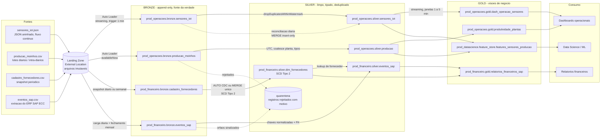

# desafio_tecnico

# Projeto NioMetal S.A. - Desafio Técnico

# Índice

- [Parte 1 — Arquitetura Medallion — Plataforma NioMetal S.A.](#parte-1--arquitetura-medallion--plataforma-niometal-sa)
- [Parte 2 — Pipeline PySpark](#parte-2--pipeline-pyspark)
- [Parte 3 — SQL Avançado](#parte-3--sql-avançado)
- [Parte 4 — Troubleshooting e Performance](#parte-4--troubleshooting-e-performance)
- [Parte 5 — Integração e nuvem](#parte-5--integração-e-nuvem)
- [Parte 6 — Uso Crítico de Ferramentas de IA](#parte-6--uso-crítico-de-ferramentas-de-ia)
- [Documentação](#documentação)

# Parte 1 — Arquitetura Medallion — Plataforma NioMetal S.A.

<a href="https://github.com/RaphaelVelloso/desafio_tecnico/blob/main/src/parte-1/diagrama_arquitetura.md" target="_blank">Diagrama Arquitetura</a>

<small><a href="#indice">⬆️ Voltar ao topo</a></small>

---

# Parte 2 — Pipeline PySpark

## 1. Problemas Técnicos Identificados no Código Original

   1. **Gargalo de Memória e Risco de Out-Of-Memory (`df.collect()`)**:  
      O método `collect()` traz todos os dados distribuídos do cluster para a memória do *Driver Node*. Em volumes reais de produção, isso gera um alto gargalo de I/O de rede e causa exceções de *Out Of Memory* (OOM), anulando o poder de processamento distribuído do Spark.
   2. **Processamento Iterativo Não Distribuído (Loop `for` em Python)**:  
      Iterar linha a linha (`for linha in dados`) força a execução sequencial na CPU do *Driver Node*. As operações do PySpark devem ser aplicadas de forma vetorial e distribuída entre os *Executors*.
   3. **Ausência de Enforcement de Schema e Leitura Lenta**:  
      A leitura sem a definição de um `schema` explícito exige que o Spark infira os tipos de dados ou leia tudo como *String*, tornando a ingestão lenta e propensa a falhas de tipagem na conversão.
   4. **Operação Não Idempotente (`mode('overwrite')`)**:  
      Sobreescrever a tabela Silver inteira a cada execução apaga o histórico de dados, causa *downtime* para os consumidores da camada Gold/Dashboards durante a carga e gera custo computacional desnecessário.
   5. **Incapacidade de Tratar Mudança de Schema**:  
      O código original ignora a transição da coluna `planta_id` para `id_planta` ao longo do arquivo, o que lança erros de chave (`KeyError`) ao tentar acessar `linha['toneladas_produzidas']`.

## 2. Pipeline Refatorado de Produção (`producao_moinhos.csv`)

   <a href="https://github.com/RaphaelVelloso/desafio_tecnico/blob/main/src/parte-2/processo_moinhos.py" target="_blank">Codigo producao moinhos</a>

## 3. Dimensão de Histórico SCD Tipo 2

   <a href="https://github.com/RaphaelVelloso/desafio_tecnico/blob/main/src/parte-2/diagrama_cadastro_fornecedor.md" target="_blank">Diagrama controle cadastro fornecedor</a>
   
   <a href="https://github.com/RaphaelVelloso/desafio_tecnico/blob/main/src/parte-2/cadastro_fornecedores.py" target="_blank">Codigo para cadastro de fornecedor</a>
   

## 4. Estratégia de Deduplicação de Dados Fora de Ordem

### Structured Streaming com Watermarking

   A estratégia ideal em Spark/Databricks para resolver este problema em tempo real (ou em micro-batches contínuos) baseia-se na combinação de dois conceitos: Watermarking e Deduplicação de Estado (Stateful Deduplication).

   <a href="https://github.com/RaphaelVelloso/desafio_tecnico/blob/main/src/parte-2/diagrama_iot.md" target="_blank">Diagrama watermark</a>

### Como Funciona a Mecânica Interna:
#### 1. Janela de Watermark (Tolerância ao Atraso):
   O Watermark estabelece o limite de tempo que o engine do Spark aceita esperar por dados atrasados em relação ao maior timestamp visto até ao momento.
   Exemplo: Com .withWatermark("timestamp", "2 hours"), se o Spark já processou um evento de 14:00, eventos com timestamp anterior a 12:00 serão descartados se chegarem depois.

#### 2. Gerenciamento de Estado (RocksDB/State Store):
   O Spark mantém um registo temporário das chaves únicas de dedup (sensor_id + timestamp) na memória/disco do executor. Quando um evento duplicado chega dentro da janela de 2 horas, o Spark compara-o com o estado e descarta-o.

#### 3. Limpeza Automática de Estado (Garbage Collection):
   Assim que o tempo do Watermark avança, o Spark limpa o estado das chaves mais antigas do que a janela definida, garantindo que a memória não estoure (Out Of Memory), mesmo que o stream rode indefinidamente.

   <a href="https://github.com/RaphaelVelloso/desafio_tecnico/blob/main/src/parte-2/sensores_iot.py" target="_blank">Exemplo simplificado deduplicacao</a>

<small><a href="#indice">⬆️ Voltar ao topo</a></small>

---

# Parte 3 — SQL Avançado

## 1. Moinhos com Maior Queda Percentual de Produção Mês a Mês (Últimos 6 Meses)
   Esta consulta calcula a produção consolidada por mês/moinho, busca o valor do mês anterior através da função de janela LAG(), calcula a variação percentual e identifica os 3 moinhos com a maior queda percentual no período.

## 2. Detecção de Anomalias de Produção (Média Móvel e Desvio Padrão de 7 Dias)
   Esta consulta analisa a série temporal diária por moinho e calcula a média móvel e o desvio padrão dos últimos 7 dias (sem incluir o próprio dia do evento, evitando contaminação do cálculo pelo pico de anomalia).

## 3. Qualidade de Dados: Violação de Integridade Referencial (eventos_sap vs cadastro_fornecedores)
   Esta consulta identifica lançamentos na tabela financeira (silver.eventos_sap) cujos fornecedores não existem na dimensão ativa de fornecedores (silver.cadastro_fornecedores), consolidando a contagem de registros e a volumetria financeira afetada agrupadas por mês de ocorrência.

   <a href="https://github.com/RaphaelVelloso/desafio_tecnico/blob/main/src/parte-3/silver.eventos_sap.sql" target="_blank">Codigo SQL para os 3 topicos</a>

<small><a href="#indice">⬆️ Voltar ao topo</a></small>

---

# Parte 4 — Troubleshooting e Performance

   Ao investigar uma degradação severa sem alteração de código, a investigação deve ir do nível macro (infra/recursos) para o nível micro (execução de DAG/código)

## 1. Análise das Métricas Globais do Cluster
   * Verifique se o autoscaling escalou até o limite máximo (8 workers).

   * Cheque se houve degradação na rede, I/O de armazenamento ou gargalo de CPU/Memória nos nós.

## 2. Executors - Spark UI
   * Identificar se os executores estão gastando muito tempo em GC Pauses.

   * Verificar se há Spill de memória/disco elevados, o que indica que os dados não cabem na RAM durante as operações wide

## 3. Jobs / Stages - Spark UI
   * Localizar qual Stage exato está consumindo a maior parte das 4 horas.

   * Analisar o gráfico de barras de duração das tasks dentro do Stage:

      * Diagnóstico de Data Skew (uma ou poucas tarefas processando quase tudo)

      * Falta de paralelismo, problema de I/O ou estouro de memória no Driver/Executors.

## 4. Análise do Plano de Execução

   * Verificar se o Spark tentou realizar o Broadcast Join com uma tabela que ficou grande demais, forçando troca para SortMergeJoin ou causando Driver Out-Of-Memory (OOM)

## 5. Hipoteses para a degradação
### 5.1. Falha no Broadcast Join

   * O enunciado menciona que a tabela cadastro_fornecedores cresceu bastante.

   * Se a tabela superou o limite de broadcast (padrão de 10 MB), o Spark altera a estratégia para SortMergeJoin ou Shuffle Hash Join. Isso introduz uma etapa massiva de Shuffle que não existia anteriormente.

   * Se o otimizador (ou o código) continuou forçando o broadcast() de uma tabela que ficou gigante, a tabela inteira foi enviada do Driver para todos os Executors, causando uso excessivo de memória, picos brutais de GC e gravação excessiva em disco.

### 5.2. Data Skew nas Transformações Wide

   * Raciocínio: O dataset de sensores costuma crescer de forma desigual (ex.: um sensor com defeito enviando milhões de eventos, ou concentração de eventos em um único timestamp ou fornecedor_id).

   * Como o pipeline faz múltiplas transformações wide (operações com Shuffle como groupBy, join ou dropDuplicates), dados agrupados pela mesma chave serão enviados para a mesma partição.

   * Se 99% das tarefas terminam em segundos e 1 tarefa fica travada por horas processando a chave desproporcional, o job inteiro fica retido aguardando essa tarefa.

## 6. Otimizações Concretas e Ações de Mitigação

### 6.1. Problema: Degradação de I/O de armazenamento ou rede (Storage/Network Throttle)

   * Converter arquivos raw para Delta/Parquet: Se o sensores_iot.json é lido em formato texto cru, usar o Auto Loader (cloudFiles) para ingerir em Delta Lake com suporte a file notification.

   * Compactação de arquivos pequenos (Small Files Problem): Executar um OPTIMIZE na tabela de fornecedores para juntar múltiplos arquivos pequenos em arquivos maiores de 1GB, reduzindo as chamadas de API ao storage.

### 6.2. Problema: Degradação de I/O de armazenamento ou rede (Storage/Network Throttle)

   * Reduzir o uso da Heap para cache: Reajustar a fração de memória usada para execução e armazenamento via spark.memory.fraction ou evitar usar .cache() em grandes conjuntos de dados desnecessariamente

### 6.3. Problema: Data Skew 

   * Mitigação Automática com AQE Skew Join: Habilitar o tratamento automático de assimetria do Spark:

      Exemplos de configurações:
      * Habilita a execução adaptativa de consultas:
         spark.conf.set("spark.sql.adaptive.enabled", "true")

      * Converte dinamicamente SortMergeJoin em BroadcastJoin se a tabela filtrada for pequena:
         spark.conf.set("spark.sql.adaptive.autoBroadcastJoinThreshold.enabled", "true")

      * Trata DATA SKEW automaticamente dividindo partições grandes em sub-partições:
         spark.conf.set("spark.sql.adaptive.skewJoin.enabled", "true")
         spark.conf.set("spark.sql.adaptive.skewJoin.skewedPartitionFactor", "5")
         spark.conf.set("spark.sql.adaptive.skewJoin.skewedPartitionThresholdInBytes", "256MB")

      * Consolida partições pequenas de Shuffle automaticamente:
         spark.conf.set("spark.sql.adaptive.coalescePartitions.enabled", "true")

   * Técnica Manual de Salting: Se a chave do groupBy ou join estiver muito concentrada (ex.: um único sensor_id tem 80% das leituras), acrescente uma coluna de "sal" aleatório para quebrar o dado em múltiplas partições antes da operação wide.

### 6.4. Estratégia de Particionamento, Reparticionamento e Caching

   * Evitar repartition() desnecessário: Se o pipeline faz repartition() sem necessidade antes das transformações wide, substitua por coalesce() quando apenas reduzir partições.

   * Ajuste de Partições de Shuffle (spark.sql.shuffle.partitions): O valor padrão (200) pode ser pequeno para o novo volume. Com AQE habilitado, pode-se definir um número inicial maior (ex.: 800), e o Spark reduzirá automaticamente se necessário.

   * Uso consciente de Caching: Se a tabela cadastro_fornecedores ou o dataset intermediário de sensores for reutilizado múltiplas vezes no mesmo DAG, faça o .persist(StorageLevel.MEMORY_AND_DISK) e lembre-se de dar .unpersist() ao final do job.

<small><a href="#indice">⬆️ Voltar ao topo</a></small>

---

# Parte 5 — Integração e nuvem

## 1. Autenticação e Gestão de Segredos

Para garantir segurança total e conformidade com boas práticas, nenhuma credencial ou chave privada fica salva no código ou em variáveis de ambiente abertas

* Gestão de Segredos (AWS Secrets Manager / Azure Key Vault):

   * Credenciais de origem (chaves SSH, tokens API REST, senhas SFTP) são armazenadas no AWS Secrets Manager ou no Azure Key Vault, aproveitando a infraestrutura onde o pipeline de borda é executado.

   * A rotação de chaves e tokens ocorre de forma automatizada via rotinas nativas de cada serviço de segredos

* Acesso por Identity Federation (IAM Roles / Managed Identities):

   * O motor de execução não utiliza usuários ou chaves de API estáticas.

   * Por meio de Federated Identity Credential / Workload Identity (conectando uma AWS IAM Role a uma Azure Managed Identity), os componentes de computação autenticam-se entre as nuvens com tokens temporários de curta duração (Princípio do Menor Privilégio)

   * Em tempo de execução, a função de ingestão recupera o segredo do cofre via SDK e estabelece a conexão segura com o fornecedor externo.

## 2. Estratégia de Retry e Idempotência

Falhas de rede ou interrupções parciais de download não podem corromper o ambiente nem gerar duplicidades.

### 2.1. Mecanismo de Retry

   * Backoff Exponencial com Jitter: Se a conexão SFTP/REST falhar ou o servidor de origem estiver indisponível, a execução realiza até 3 a 5 tentativas, aumentando progressivamente o tempo de espera (ex.: 1min, 4min, 16min) com uma variação aleatória (jitter) para evitar sobrecarregar o servidor remoto.

   * Se todas as tentativas falharem, a mensagem de controle é enviada para uma fila de falhas, acionando o time de engenharia sem interromper o restante da esteira de dados.

### 2.2. Idempotência e Tratamento de Falhas Parciais

   * Aterrissagem Atômica e Carga Silver Idempotente:
      * Os arquivos do fornecedor são baixados para o Data Lake em estrutura de partições lógicas:
   
      * O download é realizado primeiramente em arquivo temporário (.tmp). O arquivo só é renomeado para a extensão final após a validação bem-sucedida do MD5 Checksum.
   
   * Processamento Idempotente no Delta Lake:

      * O motor de processamento lê a camada Raw e grava na camada Silver via MERGE INTO no Delta Lake, ou substituição atômica de partição (mode("overwrite") com replaceWhere = "data_ingestao = 'YYYY-MM-DD'").
      
      * Reprocessar o mesmo arquivo N vezes gera rigorosamente o mesmo resultado final na tabela, sem duplicar registros.

## 3. Observabilidade e Monitoramento Cruzado

O monitoramento passivo garante que o time de dados seja notificado proativamente sobre falhas ou atrasos na entrega.

   * Alertas Dinâmicos de Falha:

      * Logs estruturados em formato JSON gerados na ingestão são transmitidos em tempo real para o Amazon CloudWatch Logs e Azure Log Analytics.

      * Exceções e erros não tratados disparam alarmes (CloudWatch Alarms / Azure Monitor Alerts) que roteiam notificações unificadas via Amazon SNS / Azure Action Groups diretamente para canais do Slack, Microsoft Teams ou ferramentas de Pager.
   
   * Detecção de Atraso

      * Um gatilho agendado (EventBridge Scheduled Rule ou Azure Logic Apps Trigger) executa no horário limite (ex.: 07:15 AM).

      * A rotina consulta diretamente os metadados do storage. Se nenhum novo arquivo for detectado na partição do dia, é emitida uma notificação "Arquivo do Fornecedor Não Entregue", por exemplo.

## 4. Controle e Otimização de Custos (FinOps)

Para evitar gastos computacionais desnecessários em dias sem arquivos novos ou finais de semana:

   * Ingestão Serverless sem Custo Ocioso:

      * O download inicial utiliza event trigger.

      * Em dias sem arquivo novo ou finais de semana, a execução é encerrada em segundos, mantendo o custo computacional em centavos de dólar por mês.
   
   * Orquestração Orientada a Eventos no Lakehouse:

      * O salvamento do arquivo na Landing Zone dispara uma notificação de evento (S3 Event -> SQS ou Azure Event Grid -> Queue).

      * O processamento no Lakehouse é acionado de forma reativa através da opção Trigger.AvailableNow (ou Trigger.Once). O cluster de processamento sobe sob demanda, processa o dado da camada Raw para a Silver e desliga automaticamente por inatividade.

   * Gestão de Ciclo de Vida do Storage:

      * Políticas integradas de retenção movem os dados da camada Raw para armazenamento de arquivamento após 30 dias, programando o expurgo definitivo após 1 ano.

<small><a href="#indice">⬆️ Voltar ao topo</a></small>

---

# Parte 6 — Uso Crítico de Ferramentas de IA

## Escolha pelo menos uma das Partes 2 a 5 e use uma ferramenta de IA (Copilot, ChatGPT, Databricks Assistant/Genie ou similar) para gerar uma primeira versão da solução antes de você revisar e ajustar.
   * IA — ChatGPT

## Crie um arquivo AI_USAGE.md contendo: o(s) prompt(s) principais usados; um resumo do que a IA sugeriu; o que você manteve, o que você mudou e por quê; e qualquer erro ou suposição incorreta que a IA tenha introduzido.

   * <a href="https://github.com/RaphaelVelloso/desafio_tecnico/blob/main/AI_USAGE.md" target="_blank">AI_USAGE</a>

   A parte escolhida para o desenvolvimento das competências foi a 2 dentro do desafio.

   O prompt inicial está dentro do arquivo.

   Partindo do começo, eu manteria parcialmente as escolhas feitas pelo Chat. Eu não colocaria Data Quality e observabilidade diretamente dentro do código do pipeline, pois isso dificultaria a escalabilidade e poderia gerar duplicação de lógica entre diferentes datasets. Para Data Quality, utilizaria uma camada ou framework reutilizável, com regras, métricas e tratamento dos registros inválidos.

   Para observabilidade, utilizaria uma solução externa de monitoramento e logging, permitindo acompanhar execução, volumetria, falhas e SLA sem acoplar essas responsabilidades ao código.

   Eu manteria a quarentena mencionada, pois os registros inválidos não deveriam ser simplesmente descartados. Seria importante preservá-los com informações de rastreabilidade, como arquivo de origem, timestamp e motivo da inconsistência, permitindo análises e possíveis reprocessamentos.

   Por fim, manteria testes e versionamento como parte do processo de desenvolvimento e CI/CD, e não necessariamente como responsabilidades do código de ingestão.

## Responda de forma dissertativa (10-15 linhas): descreva uma situação — neste desafio ou na sua experiência — em que uma sugestão de IA parecia correta à primeira vista, mas continha um erro sutil (técnico ou de lógica). Como você percebeu o erro e o que isso te ensinou sobre validar código gerado por IA?

Em um projeto recente, no qual construí um lineage técnico para migração de plataformas, utilizei uma REST API da Microsoft para capturar informações sobre datasets, dataflows, relatórios, colunas e seus relacionamentos, com o objetivo de mapear o fluxo de dados end-to-end, ou seja, da origem ate o consumo.
Para esse desenvolvimento, precisei trabalhar com grafos para representar os relacionamentos up e downstream e utilizei IA generativa como suporte na construção de algumas soluções.
O código gerado parecia estar correto e o adaptei ao meu contexto, mas, durante as validações, identifiquei um problema sutil na cardinalidade dos relacionamentos.
Alguns relacionamentos estavam sendo tratadas como muitos-para-muitos, gerando um produto cartesiano e, consequentemente, uma volumetria de dados muito maior que a esperada.
Também identifiquei problemas em cenários com ciclos dentro desses downstream datasets e dataflows,pois um consumia dado de outro e esse segundo consumia dado de um terceiro, que por sua vez consumia dado do primeiro.
Percebi os erros ao comparar a cardinalidade e a volumetria esperadas com os resultados gerados e ao validar manualmente alguns caminhos do grafo.
Isso me ensinou que um código gerado por IA pode estar sintaticamente correto e produzir resultados aparentemente plausíveis, mas ainda conter erros de lógica.
A principal lição foi que a IA deve ser utilizada como ferramenta de apoio, e não como substituta da validação técnica.
Passei a validar não apenas se o código executa, mas também suas premissas, cardinalidade, casos de borda, volumetria e resultados esperados.
Também entendi que prompts mais precisos ajudam a reduzir ambiguidades, mas não substituem o conhecimento técnico e a validação do resultado.

<small><a href="#indice">⬆️ Voltar ao topo</a></small>

---

# Documentação

## Apache Spark & Databricks Architecture

   * [Performance Tuning](https://spark.apache.org/docs/latest/sql-performance-tuning.html)
   * [Tuning Spark](https://spark.apache.org/docs/latest/tuning.html)
   * [Adaptive query execution](https://docs.databricks.com/aws/en/optimizations/aqe)
   * [Auto Loader](https://docs.databricks.com/aws/en/ingestion/cloud-object-storage/auto-loader)
   * [Delta Lake](https://docs.databricks.com/aws/en/delta)
   * [Optimize data](https://docs.databricks.com/aws/en/tables/operations/optimize)

## Segurança, Gestão de Segredos
   * [Azure Key Vault](https://learn.microsoft.com/en-us/azure/key-vault/general/overview)
   * [Azure resources](https://learn.microsoft.com/en-us/entra/identity/managed-identities-azure-resources/overview)
   * [IAM Roles e Políticas de Menor Privilégio](https://docs.aws.amazon.com/IAM/latest/UserGuide/id_roles.html)

## Padrões de Ingestão, Eventos e Armazenamento
   * [Azure Data Factory / Synapse Pipelines](https://learn.microsoft.com/en-us/azure/data-factory/connector-sftp?tabs=data-factory)
   * [Event Grid](https://learn.microsoft.com/en-us/azure/event-grid/event-schema-blob-storage?tabs=cloud-event-schema)
   * [MERGE INTO e Gravação Idempotente](https://docs.delta.io/delta-update/)

## Observabilidade, Monitoramento e Alertas
   * [Azure Monitor](https://learn.microsoft.com/en-us/azure/azure-monitor/fundamentals/overview)
   * [Alertas de Métrica e Regras de Agendamento no Azure Monitor](https://learn.microsoft.com/en-us/azure/azure-monitor/alerts/alerts-overview)
   * [EventBridge](https://docs.aws.amazon.com/eventbridge/latest/userguide/eb-what-is.html)

<small><a href="#indice">⬆️ Voltar ao topo</a></small>
