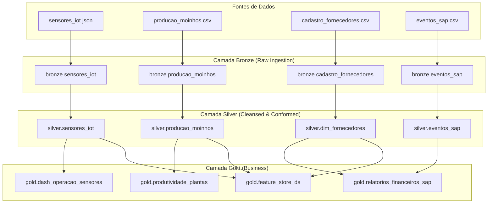

# Arquitetura Medallion

```mermaid
flowchart TD
    subgraph SOURCES["Fontes de Dados"]
        S1["sensores_iot.json"]
        S2["producao_moinhos.csv"]
        S3["cadastro_fornecedores.csv"]
        S4["eventos_sap.csv"]
    end

    subgraph BRONZE["Camada Bronze (Raw Ingestion)"]
        B1["bronze.sensores_iot"]
        B2["bronze.producao_moinhos"]
        B3["bronze.cadastro_fornecedores"]
        B4["bronze.eventos_sap"]
    end

    subgraph SILVER["Camada Silver (Cleansed & Conformed)"]
        SV1["silver.sensores_iot"]
        SV2["silver.producao_moinhos"]
        SV3["silver.dim_fornecedores"]
        SV4["silver.eventos_sap"]
    end

    subgraph GOLD["Camada Gold (Business)"]
        G1["gold.dash_operacao_sensores"]
        G2["gold.produtividade_plantas"]
        G3["gold.relatorios_financeiros_sap"]
        G4["gold.feature_store_ds"]
    end

    S1 --> B1 --> SV1 --> G1
    S2 --> B2 --> SV2 --> G2
    S3 --> B3 --> SV3 --> G3
    S4 --> B4 --> SV4 --> G3
    SV1 & SV2 & SV3 --> G4
```