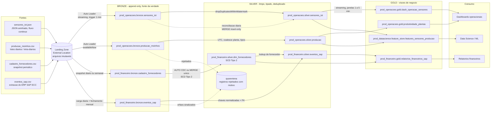

```mermaid
flowchart LR
    subgraph SRC["Fontes"]
        S1["sensores_iot.json<br/>JSON aninhado, fluxo continuo"]
        S2["producao_moinhos.csv<br/>lotes diarios / intra-diarios"]
        S3["cadastro_fornecedores.csv<br/>snapshot periodico"]
        S4["eventos_sap.csv<br/>extracao do ERP SAP ECC"]
    end

    LZ[("Landing Zone<br/>External Location<br/>arquivos imutaveis")]

    subgraph BRONZE["BRONZE - append-only, fonte da verdade"]
        B1["prod_operacoes.bronze.sensores_iot"]
        B2["prod_operacoes.bronze.producao_moinhos"]
        B3["prod_financeiro.bronze.cadastro_fornecedores"]
        B4["prod_financeiro.bronze.eventos_sap"]
    end

    subgraph SILVER["SILVER - limpo, tipado, deduplicado"]
        SV1["prod_operacoes.silver.sensores_iot"]
        SV2["prod_operacoes.silver.producao"]
        SV3["prod_financeiro.silver.dim_fornecedores<br/>SCD Tipo 2"]
        SV4["prod_financeiro.silver.eventos_sap"]
        Q[("quarentena<br/>registros rejeitados com motivo")]
    end

    subgraph GOLD["GOLD - visoes de negocio"]
        G1["prod_operacoes.gold.dash_operacao_sensores"]
        G2["prod_operacoes.gold.produtividade_plantas"]
        G3["prod_financeiro.gold.relatorios_financeiros_sap"]
        G4["prod_datascience.feature_store.features_sensores_producao"]
    end

    subgraph CONS["Consumo"]
        C1["Dashboards operacionais"]
        C2["Relatorios financeiros"]
        C3["Data Science / ML"]
    end

    S1 --> LZ
    S2 --> LZ
    S3 --> LZ
    S4 --> LZ

    LZ -->|"Auto Loader<br/>streaming, trigger 1 min"| B1
    LZ -->|"Auto Loader<br/>availableNow"| B2
    LZ -->|"snapshot diario ou semanal"| B3
    LZ -->|"carga diaria + fechamento mensal"| B4

    B1 -->|"dropDuplicatesWithinWatermark"| SV1
    B1 -.->|"reconciliacao diaria<br/>MERGE insert-only"| SV1
    B2 -->|"UTC, coalesce planta, tipos"| SV2
    B3 -->|"AUTO CDC ou MERGE unico<br/>SCD Tipo 2"| SV3
    B4 -->|"chaves normalizadas + FK"| SV4
    SV3 -->|"lookup de fornecedor"| SV4
    B2 -.->|"rejeitados"| Q
    B4 -.->|"orfaos sinalizados"| Q

    SV1 -->|"streaming, janelas 1 a 5 min"| G1
    SV2 --> G2
    SV3 --> G3
    SV4 --> G3
    SV1 --> G4
    SV2 --> G4

    G1 --> C1
    G2 --> C1
    G3 --> C2
    G4 --> C3
```